# ASAR Robot Implementation Plan

> A practical, evidence-led plan for building, validating, operating and extending the ASAR four-wheel robot.

**Document status:** implementation plan v3.0 · **updated:** 2026-09-22 · **primary scope:** verified baseline plus the complete intended ASAR system: Raspberry Pi, ROS 2, LiDAR SLAM, camera/vision and guarded edge SLM decision-making.

This plan keeps the evidence boundary clear while treating the complete system as one project:

1. **Verified baseline:** the ESP32 gateway, Arduino Mega hardware controller, four-wheel drive, ultrasonic safety, encoder RPM/odometry, MPU-6050 telemetry, WebSocket MobileAPP, relay backend, and onboard reactive autopilot represented in the current repositories.
2. **Complete target system:** true four-wheel kinematics, Raspberry Pi compute, ROS 2/Nav2, LiDAR SLAM, camera perception, sensor fusion and an edge SLM policy layer. These are designed here as first-class workstreams with interfaces, budgets, safety boundaries, tests and milestones; they become implemented capabilities only when their evidence gates pass.

The rule is simple: **a target becomes a project capability only after its source, wiring, measured behavior and acceptance evidence exist.**

## 0. How to read this plan

| Marker | Meaning | How to use it |
|---|---|---|
| `[VERIFIED]` | Directly supported by a current repository file or observed asset. | Can be used as a build input, subject to normal safety checks. |
| `[INFERRED]` | A conclusion derived from multiple sources. | Use as a working model; record the confirming experiment. |
| `[TO VERIFY]` | The repositories disagree, omit the value, or describe an unmeasured physical fact. | Do not energize or sign off until measured. |
| `[TARGET]` | Part of the complete intended system, designed here but not yet proven by the current repository. | Track it with an owner, dependency, interface and gate. |
| `[RECOMMENDED]` | A design-review suggestion from this plan, not yet selected as a project requirement. | Benchmark it against the actual robot, budget and team capability before adopting it. |
| `[FUTURE]` | A recommended extension not implemented in the present baseline. | Keep behind a milestone and an ADR; do not describe it as current behavior. |

### 0.1 Definition of done for this document

The plan is complete when a new team member can answer, without guessing:

- what the robot does today and what it does not do;
- which board owns every actuator, sensor and protocol boundary;
- how to assemble and power it safely;
- how to flash, run, test and troubleshoot every software layer;
- which algorithms are implemented, with their parameters and assumptions;
- what evidence is required at each milestone;
- what decisions were made, why they were made, and how to reverse them;
- how current work is tracked in the Team Hub; and
- which gaps must be closed before Mecanum/SLAM/vision/SLM claims are valid.

## 1. Executive summary

ASAR is a four-wheel mobile robot with a physical chassis that is shown in `presentation-studio` as a double-deck platform with four Mecanum-style wheels, ultrasonic sensors and a central ranging sensor. The executable baseline is narrower and safer: the Mega runs side-based differential motion, ultrasonic close-obstacle warning, encoder-based RPM/odometry, an MPU-6050 filter and a reactive autopilot; the ESP32 is a Wi-Fi/WebSocket gateway and UART master; the React/Capacitor MobileAPP provides control and telemetry; an optional Node.js relay provides remote access and single-leader control.

### 1.1 Current capability at a glance

| Area | Current evidence | Status / consequence |
|---|---|---|
| Low-level control | `ASAR-Project/mega/mega.ino` | `[VERIFIED]` signed side speeds, ramping, inversion flags, STOP, HORN, watchdog. |
| Gateway | `ASAR-Project/esp/esp.ino` | `[VERIFIED]` Wi-Fi STA + WebSocket server on port 81 + UART2 bridge. |
| Mobile control | `ASAR-Project/MobileAPP/src` | `[VERIFIED]` direct-first/relay-fallback WebSocket client, joystick, buttons, diagnostics and dashboard. |
| Relay control | `MobileAPP/backend/server.js` | `[VERIFIED]` Express/WS relay, optional serial COM11 path, simulation mode and leader/observer arbitration. |
| Distance safety | Mega + `DistanceAwareness.tsx` | `[VERIFIED]` four HC-SR04 inputs, median buffer, 25 cm default warning and visual warning path. |
| RPM/odometry | Mega encoder ISRs and `updateOdometry()` | `[VERIFIED]` left/right side ticks, signed RPM and planar odometry. |
| IMU | Mega MPU-6050 implementation | `[VERIFIED]` low-pass blend plus threshold suppression; telemetry frames are bridged. |
| Reactive autonomy | Mega `runAutopilot()` | `[VERIFIED]` cruise, reverse, turn, recover, goal and side-repulsion behavior. |
| True Mecanum translation | No matching body-velocity mixer in current firmware | `[TO VERIFY]/[FUTURE]` `WSPD` exists, but full `v_x/v_y/ω_z` kinematics and calibration do not. |
| LiDAR/SLAM/ROS 2 | Presentation/legacy plan only | `[TARGET]` not current baseline evidence; see the complete target architecture and M9 workstream below. |
| Google Docs copy | No connected document session in this workspace | `[TO VERIFY]` local DOCX can be generated; sharing requires a connected Google Drive/Docs session. |

### 1.2 Complete target capability at a glance

The rows below are the actual intended project, not decorative future concepts. They are marked `[TARGET]` until the corresponding implementation and acceptance evidence exist.

| Target capability | Planned implementation | Required proof |
|---|---|---|
| Edge compute platform | `[TARGET]` Raspberry Pi 5, preferably 8 GB, active cooling, 64-bit Ubuntu 24.04, SSD/NVMe-backed logs and a dedicated regulated 5 V rail. | Boot/thermal/current record, reproducible image, clean shutdown and power-loss recovery test. |
| ROS 2 robot platform | `[TARGET]` Pinned ROS 2 distribution, `asar_*` packages, `tf2` frame tree, rosbag2 recording and a bridge that can only command through the ESP32/Mega safety boundary. | `ros2 launch` bring-up, topic/TF graph, bridge loss test and repeatable bag replay. |
| LiDAR SLAM | `[TARGET]` 2D LiDAR driver → `/scan`, calibrated `base_link`/`laser` transform, wheel/IMU odometry, `slam_toolbox`, map save/load and Nav2 costmaps. | Map quality, loop-closure/relocalization scenarios, drift/latency measurements and safe fallback. |
| Camera and vision | `[TARGET]` Rigid CSI/USB camera mount, intrinsics/extrinsics, rectified image stream, quantized detector, tracking and optional LiDAR range association. | Calibration report, labeled test set, precision/recall or mAP, FPS/p95 latency and false-stop rate. |
| Edge SLM decision-making | `[TARGET]` Quantized small language model receives a structured scene summary and emits allow-listed mission decisions; it never writes PWM or bypasses Nav2/safety governor. | Schema/adversarial tests, latency/memory record, deterministic fallback and full decision audit log. |
| Full-system safety | `[TARGET]` Physical cutoff → Mega watchdog → ESP32 link watchdog → Pi safety governor → Nav2/vision/SLM command mux. | Fault-injection matrix: Pi loss, camera loss, LiDAR loss, invalid SLM output, stale commands and motor-stop timing. |

### 1.3 Success metrics for the baseline and target

- All mandatory firmware tests `T01–T14` pass without uncontrolled motion.
- End-to-end app tests `T15–T20` pass after the app path is exercised on the actual hardware.
- `STOP`, watchdog timeout and power-cutoff behavior are independently verified.
- Telemetry remains responsive while the robot is moving; no normal loop contains a long blocking operation.
- Every protocol/pin change updates the code and the spec in the same change.
- The team can reproduce the build from a clean workstation without secrets committed to Git.
- Target autonomy is evaluated against recorded scenarios, not a single demonstration: map/pose quality, navigation success, perception metrics, SLM policy validity/latency and fail-safe behavior are all logged.

## 2. Evidence base and source-of-truth policy

### 2.1 Repository roles

| Repository | What it contributes | Authority level |
|---|---|---|
| [`ASAR-Project`](../ASAR-Project/README.md) | Firmware, test sketches, formal system/hardware/UART/validation specs, MobileAPP and relay backend. | **Primary executable and interface source.** |
| [`ASAR-Team-Hub`](README.md) | Team/task/learning/meeting/exam data, Apps Script dashboard, local CSV test path and this plan. | **Governance, evidence and synchronization source.** |
| [`presentation-studio`](../presentation-studio/README.md) | Interactive visual story, slide taxonomy, mechanical/electrical concept visuals and robot photos. | **Communication and physical-context source; not executable truth.** |
| Legacy plan copy (removed after handoff) | Three-tier architecture, learning roadmap, power/PCB concepts and future autonomy direction. | **Inspiration only; every claim is reclassified below.** |

### 2.2 Important source files

- Firmware: [`esp/esp.ino`](../ASAR-Project/esp/esp.ino), [`mega/mega.ino`](../ASAR-Project/mega/mega.ino).
- Formal interfaces: [`01-system-spec.md`](../ASAR-Project/docs/spec-kit/01-system-spec.md), [`02-hardware-interface-spec.md`](../ASAR-Project/docs/spec-kit/02-hardware-interface-spec.md), [`03-uart-protocol-spec.md`](../ASAR-Project/docs/spec-kit/03-uart-protocol-spec.md).
- Delivery and tests: [`04-firmware-implementation-plan.md`](../ASAR-Project/docs/spec-kit/04-firmware-implementation-plan.md), [`05-validation-and-acceptance.md`](../ASAR-Project/docs/spec-kit/05-validation-and-acceptance.md).
- Mobile connection state: [`useRobotConnection.ts`](../ASAR-Project/MobileAPP/src/lib/useRobotConnection.ts), [`JoystickControl.tsx`](../ASAR-Project/MobileAPP/src/components/JoystickControl.tsx), [`DistanceAwareness.tsx`](../ASAR-Project/MobileAPP/src/components/DistanceAwareness.tsx).
- Relay: [`backend/server.js`](../ASAR-Project/MobileAPP/backend/server.js).
- Team governance: [`Code.gs`](Code.gs), [`Index.html`](Index.html), [`sync_local_db.py`](sync_local_db.py), [`GEMINI.md`](GEMINI.md) and `spreedsheet-copy/*.csv`.
- Presentation context: [`src/data.ts`](../presentation-studio/src/data.ts), [`AeroSlides.tsx`](../presentation-studio/src/components/AeroSlides.tsx), `assets/images/*`.

### 2.3 Reconciliation register

| Finding | Evidence | Resolution in this plan |
|---|---|---|
| Blynk appears in the older README/spec text, but current ESP32 firmware hosts a custom WebSocket server and current app code uses WebSockets. | `ASAR-Project/README.md` versus `esp/esp.ino` and `MobileAPP/src/lib/useRobotConnection.ts`. | Treat **custom WebSocket MobileAPP/relay** as the current product path. Keep Blynk as historical context until a Blynk implementation is restored and tested. |
| Older text mentions 9600 baud; current firmware uses 115200 on both sides. | README/GEMINI history versus both sketches. | Use **115200 8N1** for the current build. Record any baud change as an ADR and update all specs. |
| Physical assets show Mecanum wheels; current `setDrive(left,right)` and autopilot are differential. | Photos/presentation versus Mega code. | Baseline is **side differential**. A Mecanum upgrade must use `WSPD:FL:RL:FR:RR`, roller-orientation calibration and new acceptance tests. |
| LiDAR, SLAM, ROS 2, camera vision and edge AI appear in the presentation and legacy plan, but not in the current firmware or MobileAPP telemetry parser. | `AeroSlides.tsx` versus `ASAR-Project` source tree. | Keep them as `[TARGET]` capabilities in the complete architecture; implement through the M9 workstream without weakening the baseline safety boundary. |
| The spec says “non-blocking,” but Mega `pulseIn`, `delayMicroseconds`, initialization delay and diagnostic delays remain. | Hardware spec versus `mega.ino`. | Permit only short hardware-timing calls in isolated paths; schedule a non-blocking ultrasonic driver and keep diagnostics out of normal motion. |
| Presentation claims 3S/12.6 V, 5 V and 9 V rails, but no measured BOM/current budget exists in the executable repo. | `AeroSlides.tsx`, legacy plan, hardware spec. | Treat battery/regulator/driver ratings as `[TO VERIFY]`; measure current and verify the exact L298N board before wiring. |
| Relay enforces leader/observer, but the ESP32 direct WebSocket path has no equivalent arbitration. | `backend/server.js` versus `esp.ino`. | Direct mode is for one trusted operator until a direct-mode control lease and disconnect STOP are implemented. |
| Wi-Fi credentials are present as literals in `esp.ino`. | `esp/esp.ino`. | Rotate exposed credentials, move them to a local untracked configuration mechanism and add a secret-scan gate. |

## 3. System architecture

### 3.1 Baseline topology

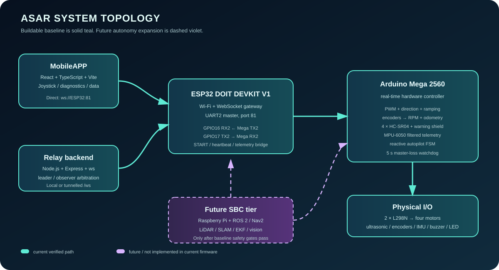

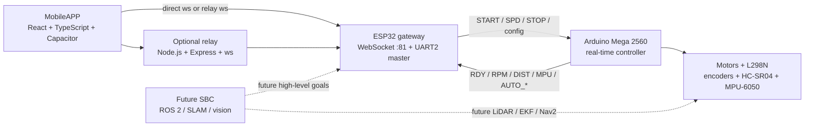
```mermaid
flowchart LR
    APP[MobileAPP<br/>React + TypeScript + Capacitor]
    RELAY[Optional relay<br/>Node.js + Express + ws]
    ESP[ESP32 gateway<br/>WebSocket :81 + UART2 master]
    MEGA[Arduino Mega 2560<br/>real-time controller]
    IO[Motors + L298N<br/>encoders + HC-SR04 + MPU-6050]
    SBC[Future SBC<br/>ROS 2 / SLAM / vision]

    APP -->|direct ws or relay ws| ESP
    APP --> RELAY --> ESP
    ESP -->|START / SPD / STOP / config| MEGA
    MEGA -->|RDY / RPM / DIST / MPU / AUTO_*| ESP
    MEGA --> IO
    SBC -.->|future high-level goals| ESP
    SBC -.->|future LiDAR / EKF / Nav2| IO
```

### 3.2 Complete target architecture

The complete project adds a Raspberry Pi autonomy tier without turning it into a second motor controller. The Pi owns ROS 2 orchestration, mapping, navigation, perception and mission-level decisions. The ESP32 remains the network/gateway and command lease boundary; the Mega remains the final real-time actuation, local obstacle and watchdog authority.

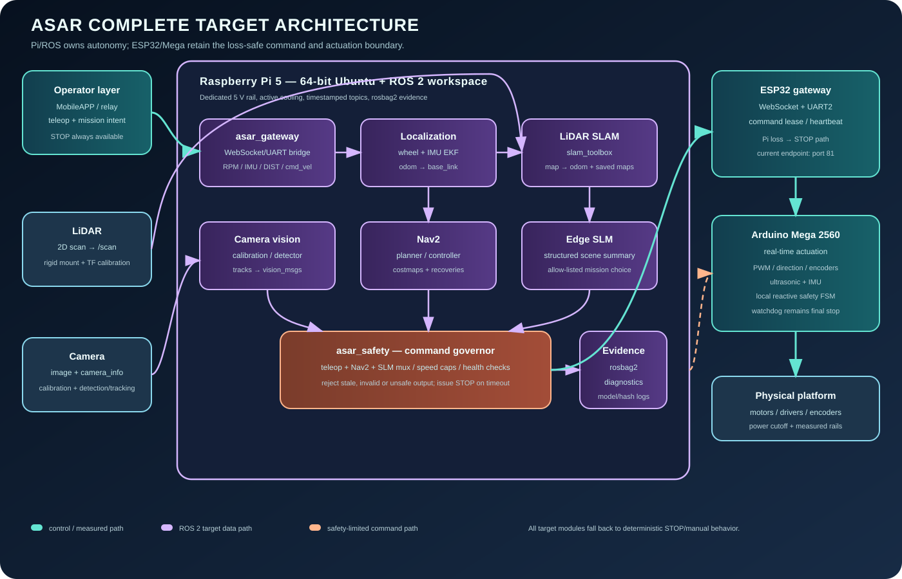

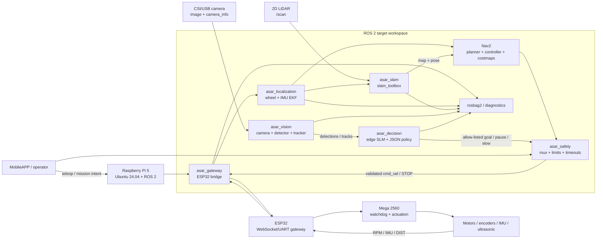
```mermaid
flowchart LR
    OP[MobileAPP / operator]
    PI[Raspberry Pi 5<br/>Ubuntu 24.04 + ROS 2]
    subgraph ROS[ROS 2 target workspace]
        GW[asar_gateway<br/>ESP32 bridge]
        ODOM[asar_localization<br/>wheel + IMU EKF]
        SLAM[asar_slam<br/>slam_toolbox]
        NAV[Nav2<br/>planner + controller + costmaps]
        CAM[asar_vision<br/>camera + detector + tracker]
        SLM[asar_decision<br/>edge SLM + JSON policy]
        SAFE[asar_safety<br/>mux + limits + timeouts]
        REC[rosbag2 / diagnostics]
    end
    LIDAR[2D LiDAR<br/>/scan]
    CAMERA[CSI/USB camera<br/>image + camera_info]
    ESP[ESP32<br/>WebSocket/UART gateway]
    MEGA[Mega 2560<br/>watchdog + actuation]
    IO[Motors / encoders / IMU / ultrasonic]

    OP -->|teleop / mission intent| PI
    PI --> GW
    LIDAR --> SLAM
    CAMERA --> CAM
    IO -->|RPM / IMU / DIST| ESP --> GW
    GW --> ODOM
    ODOM --> SLAM
    ODOM --> NAV
    SLAM -->|map + pose| NAV
    CAM -->|detections / tracks| SLM
    NAV --> SAFE
    SLM -->|allow-listed goal / pause / slow| SAFE
    OP --> SAFE
    SAFE -->|validated cmd_vel / STOP| GW --> ESP --> MEGA --> IO
    GW --> REC
    ODOM --> REC
    SLAM --> REC
    CAM --> REC
    SLM --> REC
```

Target ROS graph files are kept beside the Markdown source in `docs/asar-plan-assets/mermaid/target-ros-graph.mmd`, `autonomy-sequence.mmd` and `slm-safety.mmd` so they can be rendered in CI and reviewed independently.

### 3.3 Responsibility split

| Layer | Owns | Must not own |
|---|---|---|
| MobileAPP | Human intent, connection selection, controls, visible status, diagnostics, bounded history. | Direct motor pin assumptions, safety-critical actuation decisions, secrets. |
| Relay | Remote transport, simulation, serial bridge option, leader/observer arbitration, observability. | Final motor safety; it must fail safe if it disappears. |
| ESP32 | Wi-Fi/WebSocket endpoint, command bridge, session handshake, heartbeat, upstream telemetry forwarding. | High-current PWM timing or unverified autonomy decisions. |
| Mega | PWM/direction, encoder ISR/RPM, ultrasonic/IMU sampling, watchdog, warning, autopilot actuation. | Network credentials, UI state, cloud APIs. |
| Team Hub | Tasks, people, learning, meetings, validation evidence and release status. | Acting as a real-time control path. |
| Raspberry Pi / ROS 2 | Sensor drivers, `tf2`, wheel/IMU state estimation, LiDAR SLAM, Nav2, camera perception, rosbag2 and mission-level behavior. | Direct PWM, raw motor pins, bypassing the ESP32/Mega safety chain or treating an SLM answer as trusted actuation. |
| ROS safety governor | One command mux for teleop, Nav2, recovery and SLM outputs; speed/region/time limits; stale-command and sensor-health handling. | Overriding a physical stop, Mega watchdog or a hard safety fault. |

### 3.4 Connection modes

**Direct mode:** `MobileAPP → ws://<ESP32_IP>:81`. Lowest latency and no relay dependency. Use only on a trusted LAN, with one operator, until a direct control lease is added.

**Relay mode:** `MobileAPP → ws://<relay>:3001/ws → ESP32`. The relay supports a single leader and multiple observers, can reconnect to the ESP32, can run simulation mode, and can optionally open a direct Mega USB serial path. A leader disconnect must issue `STOP` before promoting an observer; this is a required hardening item.

### 3.5 Safety invariants

1. `STOP` is valid at every runtime state and is never throttled.
2. Mega refuses motion before `START`/`RDY` and stops after 5 s without master traffic.
3. Invalid or over-range motion frames do not create motion.
4. A physical power cutoff remains available during every bench test.
5. Pi planners, vision and the SLM may request only validated goals or bounded velocity commands; the Mega remains the final actuation and safety authority.
6. A no-echo ultrasonic value (`0`) is not treated as a close obstacle by itself.
7. An SLM cannot issue raw PWM, disable a watchdog, invent an unapproved tool call or bypass the safety governor.
8. Unverified visual concepts never become acceptance evidence; `[TARGET]` architecture is tracked separately from `[VERIFIED]` behavior.

## 4. Project processes and working method

### 4.1 Work item lifecycle

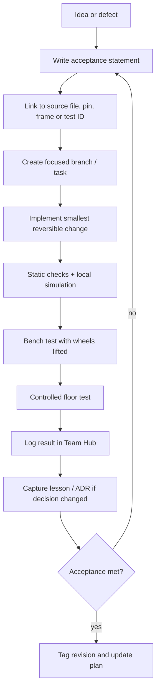
```mermaid
flowchart TD
    IDEA[Idea or defect] --> SPEC[Write acceptance statement]
    SPEC --> TRACE[Link to source file, pin, frame or test ID]
    TRACE --> BRANCH[Create focused branch / task]
    BRANCH --> BUILD[Implement smallest reversible change]
    BUILD --> CHECK[Static checks + local simulation]
    CHECK --> BENCH[Bench test with wheels lifted]
    BENCH --> FIELD[Controlled floor test]
    FIELD --> EVIDENCE[Log result in Team Hub]
    EVIDENCE --> LEARN[Capture lesson / ADR if decision changed]
    LEARN --> DONE{Acceptance met?}
    DONE -->|no| SPEC
    DONE -->|yes| RELEASE[Tag revision and update plan]
```

### 4.2 Git and review rules

- One change should have one clear purpose: firmware, app, wiring, docs or visual asset.
- Commit protocol and pin changes together with their spec changes; never update only one side of a UART contract.
- Before a physical test, record firmware revision, wiring revision, battery state, operator and test IDs.
- Do not commit Wi-Fi keys, API keys, tunnels, local IPs that are not deliberately public, `.env` files or personal access tokens.
- Review safety changes with a second person; the author must demonstrate both normal and failure behavior.
- If a test fails, return to the earliest failing layer. Do not hide a hardware fault with a higher-level workaround.

### 4.3 Team Hub evidence workflow

The Team Hub is the project’s coordination and learning system, not the robot control plane.

1. Create a `Task` with a concrete Definition of Done and one or more assignees.
2. Link the task to a milestone and test IDs in the description.
3. Use `Log` for meetings, skills, learning, exams and evidence; include the firmware revision or photo filename where appropriate.
4. Use `Learning` tracks to close gaps in C/C++, interrupts, UART, Git, CAD, KiCad, ROS 2 and sensor fusion.
5. Run `python sync_local_db.py` after Excel changes; verify the local dashboard before publishing Apps Script changes.
6. Close the task only when the evidence is attached and the relevant gate passes.

The current snapshot already models team members, learning tracks, tasks, meetings and logs. It should be extended with `Milestone`, `Test ID`, `Evidence link`, `Risk`, and `Owner` fields rather than burying technical evidence in free text.

### 4.4 Visual operating guides

Use the following three diagrams as bench and release artifacts. The connection guide explains what is physically connected; the deployment guide explains what is installed and in which order; the exploratory-test guide explains how to investigate uncertainty without turning a demo into an acceptance claim. The editable Mermaid sources for the latter two are kept in `docs/asar-plan-assets/mermaid/`.

#### Connection setup: connect in this order

<figure>
  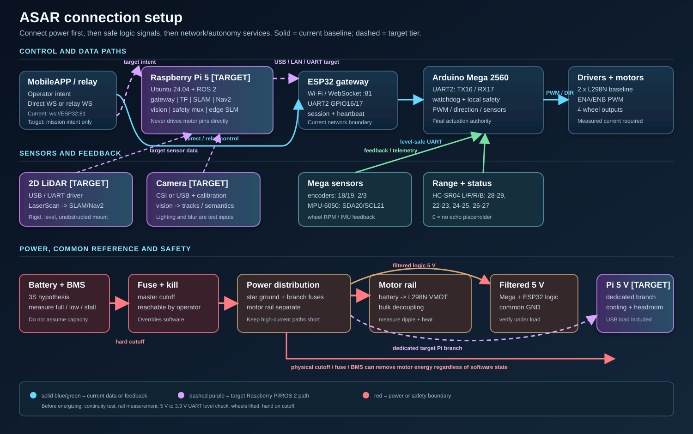
  <figcaption>Connection setup: solid paths are the current Mega/ESP32 baseline; dashed paths are the Raspberry Pi/ROS 2 target. Red paths are power or hard-safety boundaries.</figcaption>
</figure>

1. Keep the battery disconnected. Verify polarity, fuse, BMS, cutoff, connector locking, continuity and the expected common-ground points.
2. Build and measure the protected rails: motor rail, filtered 5 V logic rail and the dedicated target Pi rail. Do not power the Pi from an unmeasured Mega regulator.
3. Connect Mega peripherals and motor drivers. Motor current must stay on the power distribution and driver path; it must not pass through a breadboard or MCU pin.
4. Connect the UART with crossed, level-safe signals: Mega TX2 pin 16 -> divider/level shifter -> ESP32 GPIO16 RX2; ESP32 GPIO17 TX2 -> Mega RX2 pin 17; connect the grounds deliberately. Never apply raw Mega 5 V to an ESP32 input.
5. For the target tier, connect the LiDAR and camera to the Raspberry Pi, give them mechanical strain relief, and connect the Pi to the ESP32 through the planned USB/LAN/UART gateway path. The Pi never connects directly to motor-driver inputs.
6. Power logic only, verify `START`/`RDY`, telemetry and watchdog behavior, then connect motor power with wheels lifted and a hand on the cutoff.

#### Deployment: install, health-check, then release

<figure>
  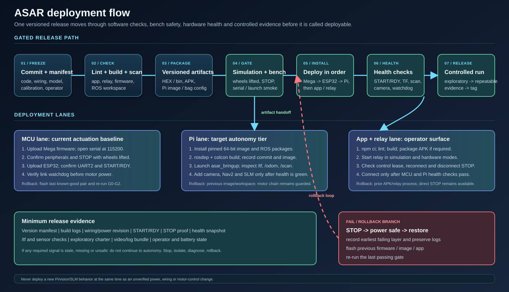
  <figcaption>Deployment flow: every lane joins the same health gate, and a missing or unsafe signal goes to STOP and rollback.</figcaption>
</figure>

1. Freeze one version manifest containing the Git revision, wiring revision, firmware pair, MobileAPP/relay revision, Pi image/workspace, calibration files and model revision.
2. Build and check the artifacts: `npm ci`, lint and build the MobileAPP; install and smoke-test the relay; compile both MCU targets; run the target ROS workspace checks when that tier is in scope.
3. Test the artifacts with simulation or wheels lifted. Prove `STOP`, malformed-frame refusal, watchdog timeout, serial logging and launch health before applying motor power.
4. Deploy in this order: Mega firmware, ESP32 firmware and `START`/`RDY`; then the target Pi workspace and `asar_bringup`; then the MobileAPP and relay. This keeps the final actuation and watchdog boundaries established before higher-level commands appear.
5. Check the required signals: MCU handshake and telemetry; Pi `/tf`, `/odom`, `/scan` and diagnostics; camera calibration/frames; Nav2 readiness; safety-mux state; and app control lease/reconnect behavior.
6. Run the controlled exploratory charter, attach the logs/video/bag and operator/battery state, and promote the result to a release only after the relevant gate passes. If a health check fails, issue `STOP`, isolate the earliest failing layer, restore the last known-good artifact and rerun the last passing gate.

Illustrative target Pi deployment commands (package and launch names remain `[TARGET]` until the ROS workspace is implemented):

```bash
cd ~/asar_ws
rosdep install --from-paths src --ignore-src -r -y
colcon build --symlink-install
source install/setup.bash
ros2 launch asar_bringup robot.launch.py
```

#### Exploratory testing: turn uncertainty into evidence

<figure>
  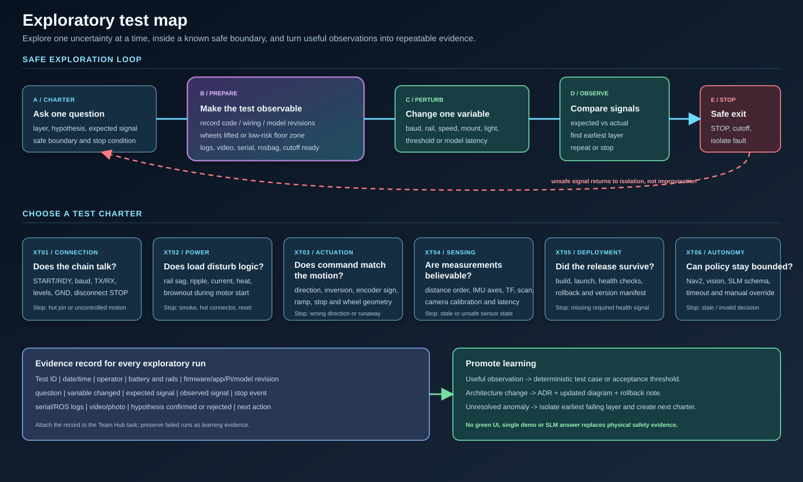
  <figcaption>Exploratory test map: use one question and one changed variable at a time, with an explicit stop condition and a path to a repeatable test or ADR.</figcaption>
</figure>

Start every exploratory run with a short charter: question, layer, hypothesis, expected signal, safe boundary, changed variable, stop condition and evidence to collect. Begin with low-risk logic-only or wheels-lifted tests; move to a controlled floor only after the lower layer is trusted. Useful starter charters are `XT01` connection/handshake, `XT02` power sag and heat, `XT03` actuation and encoder sign, `XT04` sensing/TF/camera, `XT05` deployment/rollback and `XT06` bounded Nav2/vision/SLM behavior.

During the run, change one variable, compare expected versus actual signals, and stop at the first unsafe or stale-health indication. Record the Test ID, timestamp, operator, battery/rails, all code/calibration/model revisions, commands, serial or ROS logs, video/photo, anomaly, hypothesis result and next action. A useful observation becomes a deterministic test threshold or ADR; an unresolved anomaly becomes the next isolated charter. A green UI, a single demo or an SLM answer is never physical safety evidence.

## 5. Physical platform and mechanical setup

### 5.1 What is visibly present

<figure>
  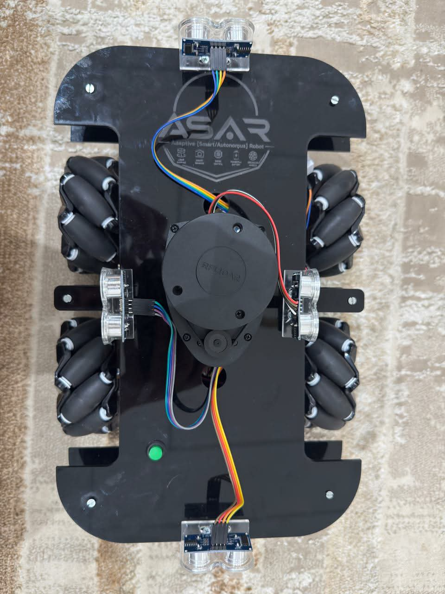
  <figcaption>Real top-view asset from <code>presentation-studio</code>. It is useful for placement discussion; it does not prove every shown sensor is wired to the current firmware.</figcaption>
</figure>

<figure>
  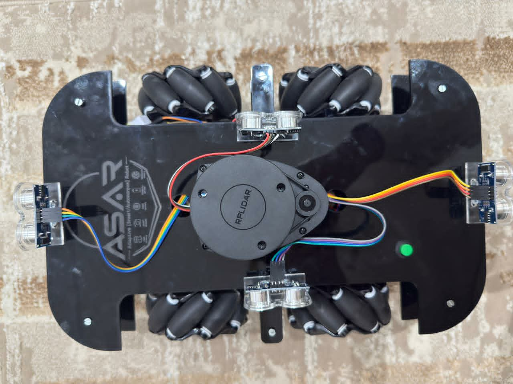
  <figcaption>Real sensor/chassis view. The plan keeps ultrasonic sensing in the baseline and treats the central ranging unit as an upgrade until its electrical and software path is verified.</figcaption>
</figure>

<figure>
  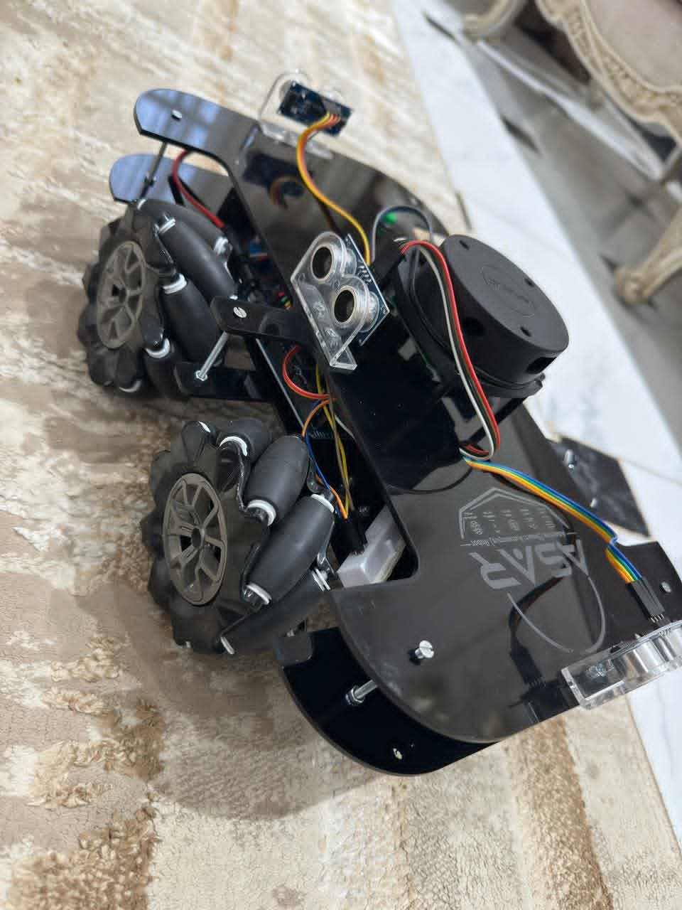
  <figcaption>Real side view used to reason about clearance, cable strain relief and low-deck mass.</figcaption>
</figure>

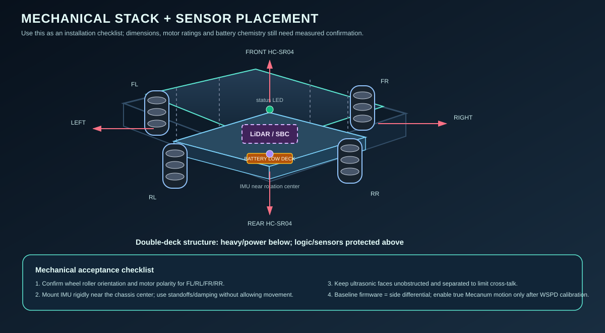

### 5.2 Mechanical bill of materials and status

| Item | Current evidence | Build instruction / verification |
|---|---|---|
| Chassis | Presentation describes a rounded, double-deck acrylic structure; photos show a two-level black plate assembly. | Inspect cracks, standoffs and fasteners; keep power/mass low and logic/sensors protected. Record length, width, deck spacing and total mass. |
| Four wheel modules | Photos and presentation show Mecanum-style rollers. | Confirm roller orientation (X/O pattern), wheel diameter and axle alignment. If the robot is operated as differential drive, document that lateral translation is not accepted. |
| Four geared DC motors | Presentation names JGA25-370 as a concept; firmware only assumes motor outputs. | Record motor voltage, no-load/stall current, gearbox ratio and encoder PPR from the actual parts. Never infer these from a slide. |
| Two L298N boards | Firmware pin map has two left/right banks, two PWM enables per bank. | Verify board input/logic voltage, VMOT range, thermal behavior and common ground. Do not use a “9 V gate rail” without the exact board datasheet. |
| Four HC-SR04 | Firmware maps L/F/R/B triggers and echoes. | Mount faces clear of deck edges and each other; add acoustic separation or timing if cross-talk appears. |
| MPU-6050 | Firmware uses I2C `0x68`; presentation places it near the center. | Rigidly mount near the chassis rotation center; record axis orientation and calibrate bias while stationary. |
| Encoders | Mega uses left A/B on 18/19 and right A/B on 2/3. | Verify whether each side signal is one wheel or a side aggregate; confirm PPR and direction. Current odometry does not independently measure all four wheels. |
| LiDAR/ranging head | Present in photos/presentation context; no current driver/telemetry path. | `[TARGET]` select a ROS 2-supported 2D LiDAR; document model, voltage, scan rate, range, UART/USB protocol, mount height, `laser` transform and occlusion test before integration. |
| Raspberry Pi compute | Not proven in the current executable tree; legacy/presentation material describes an SBC tier. | `[TARGET]` mount a cooled Pi with serviceable storage, dedicated regulated rail, isolated high-current wiring and a recoverable OS image. Record current/thermal headroom under ROS + sensors + model runtime. |
| Camera mount | Presentation contains conceptual camera/vision direction; current app/firmware has no camera stream. | `[TARGET]` use a rigid CSI/USB mount with known `camera_link` transform, lens clearance, cable strain relief and repeatable calibration target. |
| Edge inference hardware | No current model or accelerator is specified. | `[TARGET]` start CPU-only; add a USB/PCIe accelerator only when measured Pi latency/memory/power data justifies it. |
| Battery/BMS/bucks | Presentation/legacy plan claims 3S 11.1/12.6 V and LM2596 rails; executable repo does not specify a measured BOM. | `[TO VERIFY]` measure pack chemistry, BMS rating, fuse, regulator output/current and motor stall current before connecting. |

### 5.3 Mechanical installation sequence

1. **Bench inventory:** label FL, RL, FR, RR, photograph every connector and record motor/encoder identity.
2. **Chassis inspection:** torque standoffs, check plate flatness, remove sharp edges, verify wheel clearance through the full suspension/roller envelope.
3. **Motor installation:** mount motors square to the plates, keep shafts parallel, and mark the positive physical rotation direction.
4. **Wheel orientation:** for Mecanum wheels, confirm the roller geometry as an X or O pattern from the top view. Do not assume a single `SPD:left:right` command will produce strafe.
5. **Mass placement:** place battery, drivers and fuse low; place logic and sensor interfaces on the upper deck with airflow and service access.
6. **IMU placement:** mount close to the rotation center, with known axes, no loose cable loop that can move the board, and optional vibration isolation that does not permit yaw/pitch motion.
7. **Ultrasonic placement:** align each transducer to the intended cardinal direction; avoid a bracket or plate in its cone; label the harness L/F/R/B.
8. **Cable management:** separate motor power from UART/I2C/echo wiring, add strain relief at moving parts, and leave a visible service loop for board removal.
9. **Wheels-lifted test:** only after continuity and polarity checks, run `motor_only_tst` at low PWM and verify one motor at a time.

### 5.4 Motion models and calibration

#### Baseline: side differential motion

For left/right side linear velocities `v_L`, `v_R` and wheel-track width `b`:

```text
v_x     = (v_R + v_L) / 2
omega_z = (v_R - v_L) / b
```

The Mega’s current `setDrive(left,right)` and autopilot use this model. Equal signs and magnitudes produce straight motion; opposite signs produce an in-place rotation; unequal same-sign values produce an arc.

#### Upgrade: four-wheel Mecanum body-velocity mapping

The legacy plan provides a useful starting matrix for body velocity `[v_x, v_y, omega_z]`, wheel radius `r` and half-dimensions `L_x`, `L_y`. The signs depend on wheel indexing and roller orientation, so it must be treated as a calibration hypothesis:

```text
[ω_FL]   1/r [ 1  -1  -(Lx + Ly)] [v_x]
[ω_FR] = 1/r [ 1   1   (Lx + Ly)] [v_y]
[ω_RL]   1/r [ 1   1  -(Lx + Ly)] [ω_z]
[ω_RR]        [ 1  -1   (Lx + Ly)]
```

Implementation sequence:

1. Measure `r`, `Lx`, `Ly`, encoder PPR and the actual roller pattern.
2. Add a pure-wheel `WSPD:FL:RL:FR:RR` calibration screen and current feedback for each wheel.
3. Validate forward, reverse, strafe, rotate and four diagonal vectors with the wheels lifted.
4. Calibrate sign and scale per wheel; store inversion factors in a versioned configuration.
5. Add body-velocity commands only after the four-wheel command path is proven.
6. Update odometry to use all measured wheel velocities; do not reuse the two-side estimator unchanged.

### 5.5 Mechanical acceptance checklist

- [ ] Wheel labels and roller orientation are documented in a photo.
- [ ] Measured wheel diameter, track/base dimensions and encoder PPR are recorded.
- [ ] Every wheel spins freely without cable or chassis interference.
- [ ] The center of gravity remains inside the support polygon during acceleration and braking.
- [ ] Sensor faces are unobstructed; their orientation is recorded.
- [ ] The IMU axes are recorded and a stationary bias sample is saved.
- [ ] No loose high-current conductor can contact a rotating wheel or exposed frame.
- [ ] A physical power cutoff can be reached by the operator.

## 6. Electrical, wiring and hardware setup

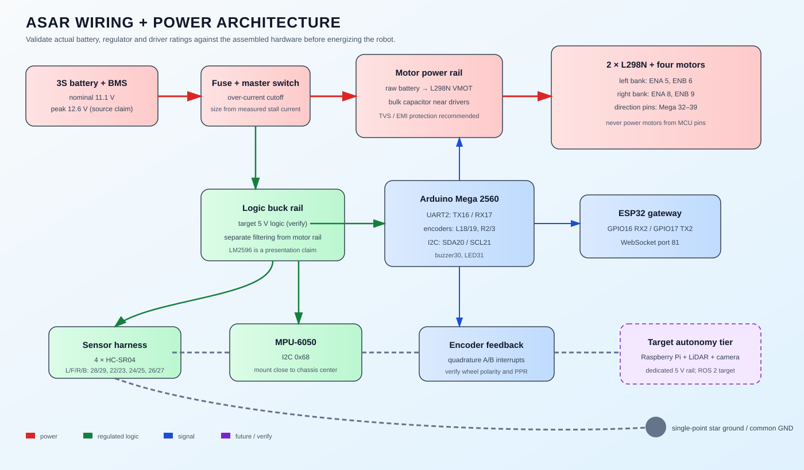

Use the full [connection setup guide](#44-visual-operating-guides) before changing the harness. It shows the current UART/power boundaries together with the target Pi, LiDAR and camera branches.

### 6.1 Pin map — current Mega interface

| Function | Mega pin(s) | Electrical / ownership note |
|---|---:|---|
| UART2 to ESP32 | TX 16, RX 17 | 115200 8N1; cross TX→RX and share GND. Use level shifting or a divider for Mega 5 V TX → ESP32 3.3 V RX. |
| Front ultrasonic | TRIG 22, ECHO 23 | Sensor order in `DIST` is L:F:R:B, not physical array order in the code. |
| Right ultrasonic | TRIG 24, ECHO 25 | Verify the harness label before acceptance. |
| Rear ultrasonic | TRIG 26, ECHO 27 | `0` means no echo/clear placeholder, not zero centimetres. |
| Left ultrasonic | TRIG 28, ECHO 29 | Rotate through the four sensors; median buffer size is 5. |
| Buzzer / status LED | 30 / 31 | Active-high outputs; inactive on startup and idle. |
| Left L298N direction | IN1/IN2/IN3/IN4 = 32/33/34/35 | FL/RL bank; `ENA=5`, `ENB=6`. |
| Right L298N direction | IN1/IN2/IN3/IN4 = 36/37/38/39 | FR/RR bank; `ENA=8`, `ENB=9`. |
| Encoder left | A/B = 18/19 | Interrupt on channel A, channel B establishes direction. |
| Encoder right | A/B = 2/3 | Interrupt on channel A, channel B establishes direction. |
| MPU-6050 I2C | SDA 20, SCL 21 | Address `0x68`; verify pull-ups and voltage compatibility. |

### 6.2 ESP32 and UART wiring

| Signal | Connect | Required check |
|---|---|---|
| ESP32 GPIO17 TX2 | level shifter / safe logic path → Mega RX2 pin 17 | 3.3 V high level must be recognized by the Mega. |
| Mega TX2 pin 16 | divider / level shifter → ESP32 GPIO16 RX2 | Do not feed a raw Mega 5 V signal into the ESP32 pin. |
| GND | ESP32 ↔ Mega ↔ sensor/driver logic ground | Measure continuity with power removed. |
| Motor rail | battery/BMS/fuse → L298N VMOT | Keep off logic rails; verify current and thermal limits. |
| Logic rail | regulator → Mega/ESP32/sensors as permitted by each board | Measure under load; never trust a nominal label. |

### 6.3 Safe power-up order

1. Remove wheels from the floor and disconnect motor power if possible.
2. Inspect the fuse, master switch, BMS wiring, polarity and connector locking.
3. With the battery disconnected, measure continuity between the expected grounds and test for shorts between each positive rail and ground.
4. Power the logic rail only; measure the regulator output at the Mega, ESP32 and sensors.
5. Confirm the ESP32 UART pins are not exposed to a 5 V signal.
6. Connect motor drivers with the motor outputs unloaded; check driver idle current and heat.
7. Connect one motor at a time and run the isolated motor test at a low duty cycle.
8. Connect the full harness, then run the formal gates with a hand on the cutoff and a serial STOP command ready.

### 6.4 Power architecture recommendations

The physical assets and legacy plan describe a 3S battery with a 12.6 V maximum and regulated logic rails. That is a useful design hypothesis, not a verified specification. Before the first full-power test, document:

- cell chemistry, nominal/full/low voltage and BMS current rating;
- motor no-load and stall current at the chosen voltage;
- fuse rating and interrupt capacity;
- each buck converter’s input range, output voltage, continuous current, thermal derating and cooling;
- L298N board logic supply and motor supply limits;
- logic brownout behavior while motors start and reverse;
- bulk/ceramic decoupling location and measured ripple;
- whether a separate 5 V rail is required for the central ranging sensor;
- the Raspberry Pi 5 + USB/CSI sensor + optional accelerator peak load, regulator headroom, fuse and brownout behavior;
- whether Pi, LiDAR and camera grounds/noise require a separate filtered branch while preserving a deliberate common reference for the gateway interface;
- whether any signal isolation is real galvanic isolation or only a level shifter.

Do not implement the legacy plan’s “9 V gate rail” as a default. L298N modules vary; verify the board schematic and logic requirements first. Keep the design able to stop safely if the logic regulator drops out.

### 6.5 Wiring acceptance checklist

- [ ] Power and signal wiring are color-coded and labeled at both ends.
- [ ] UART TX/RX are crossed, level-safe and share a common ground.
- [ ] Motor power does not pass through a breadboard or MCU pin.
- [ ] Driver enable pins are confirmed PWM-capable on the actual Mega.
- [ ] Each ultrasonic trigger/echo pair is verified against the L/F/R/B label.
- [ ] Encoder A/B phases and direction are verified with the wheel lifted.
- [ ] I2C address scan finds the MPU-6050 at `0x68`.
- [ ] Fuse, cutoff and BMS are installed before the first battery-powered run.
- [ ] High-current conductors are strain-relieved and physically separated from I2C/UART.
- [ ] Pi 5 rail is measured under ROS, LiDAR, camera and model-runtime load; it is not borrowed from an unverified Mega rail.
- [ ] Pi/LiDAR/camera restart and power-loss behavior cannot energize motors without a fresh safe session.
- [ ] A measured power/current record is attached to the Team Hub task.

## 7. Software toolchain and setup

### 7.1 Current implementation toolchain

| Layer | Current tool | What it implements | Verification command / action |
|---|---|---|---|
| Mega/ESP32 firmware | Arduino IDE 2.x or PlatformIO/VS Code | Board packages, upload, serial monitor, C/C++ sketches. | Compile each sketch for its target board; record board package and commit. |
| Mega tests | Arduino sketches under `tst/` | Isolated motor, encoder, ultrasonic, MPU, UART and Blynk-era probes. | Flash one test at a time; save serial output. |
| MobileAPP | React 19, TypeScript, Vite, Tailwind CSS 4, Motion, Recharts | Control UX, connection state, telemetry and charts. | `npm ci`; `npm run lint`; `npm run build`. |
| Android shell | Capacitor 6 + Android project | Native Android packaging of the web app. | `npm run build`; `npx cap sync android`; open/build in Android Studio. |
| Relay | Node.js, Express, `ws`, `serialport` | Remote WebSocket path, simulation, optional COM11 bridge, leader/observer. | `npm ci` in `MobileAPP/backend`; `npm start`; inspect `/api/status`. |
| Team governance | Google Apps Script + Google Sheets + local CSV dashboard | Team, task, learning, meeting, exam and log state. | `python sync_local_db.py`; run local HTTP server; verify local dashboard. |
| Presentation/docs | React/Vite/Tailwind/Motion, Markdown, Mermaid, SVG | Visual narrative, diagrams and reviewable engineering plan. | Build `presentation-studio`; render/check the SVG and Mermaid assets. |

### 7.2 Recommended toolchain evolution

| Need | Recommendation | Why / boundary |
|---|---|---|
| Reproducible MCU builds | **PlatformIO** with checked-in `platformio.ini`, pinned platforms/boards and CI build jobs. | It supports Arduino frameworks for Atmel AVR and Espressif targets and gives a repeatable CLI/build/test path. Keep Arduino IDE as the first bring-up fallback. |
| Schematic/PCB | **KiCad** for source-controlled schematic, footprints, PCB, DRC and Gerbers. | Use only after the measured power/current budget exists. Do not fabricate a board from the concept slide. |
| Mechanical CAD | **Fusion 360 or SolidWorks** for parametric chassis, brackets, DXF/STL exports and interference checks. | Record actual dimensions and materials; keep CAD revision alongside photos and BOM. |
| Offline telemetry analysis | **Python** with CSV/JSON logs, NumPy/Pandas and plots. | Tune RPM, distance, IMU and latency using recorded data, not memory. |
| Complete autonomy compute | **Raspberry Pi 5 (8 GB target) + 64-bit Ubuntu 24.04 + a pinned ROS 2 distribution**; use Jazzy as the starting candidate, then freeze the exact distribution/package set at M9. | `[TARGET]` Pi power, cooling, storage and CPU budget must be measured; the Pi never bypasses the ESP32/Mega safety boundary. |
| ROS 2 package architecture | `asar_bringup`, `asar_description`, `asar_msgs`, `asar_gateway`, `asar_localization`, `asar_slam`, `asar_navigation`, `asar_vision`, `asar_decision`, `asar_safety`. | Keep sensor, frame, command and safety interfaces explicit; record launch parameters and QoS profiles in Git. |
| LiDAR SLAM | 2D LiDAR driver → `sensor_msgs/LaserScan` → calibrated `tf2` → `slam_toolbox` → saved map / Nav2 costmaps. | `[TARGET]` select the exact LiDAR only after range, scan rate, voltage, driver and mount clearance are verified. |
| Camera / vision | CSI or USB RGB camera, `camera_info` calibration, OpenCV preprocessing, quantized ONNX Runtime or TFLite detector, tracker and `vision_msgs` output. | `[TARGET]` benchmark on the actual Pi and test lighting, blur, occlusion and false-stop behavior before using detections for navigation. |
| Edge SLM | A quantized small model through a constrained local runtime such as llama.cpp or ONNX Runtime; structured JSON output and a deterministic policy validator. | `[TARGET]` SLM sees structured world state, not raw motor values; invalid, stale or slow output falls back to Nav2/manual/STOP. |
| Autonomy evidence | rosbag2, RViz, `tf2_tools`, `diagnostic_updater`, Python/NumPy/Pandas and a versioned scenario/dataset registry. | Every map, detection, decision and fault-injection result carries code, model, calibration and hardware revisions. |
| Documentation | Markdown + Mermaid + hand-authored SVGs + local raster evidence. | Diagrams remain diffable and visuals remain portable into DOCX. |

Official references used for these recommendations: [Arduino IDE software documentation](https://docs.arduino.cc/software/ide/), [PlatformIO stable documentation](https://docs.platformio.org/en/stable/), [KiCad Getting Started](https://docs.kicad.org/master/en/getting_started_in_kicad/getting_started_in_kicad.pdf), [ROS 2 Jazzy installation](https://docs.ros.org/en/jazzy/Installation/Ubuntu-Install-Debs.html), [Nav2 documentation](https://docs.nav2.org/), [`slam_toolbox` project](https://github.com/SteveMacenski/slam_toolbox), [OpenCV camera calibration](https://docs.opencv.org/4.x/dc/dbb/tutorial_py_calibration.html), [ONNX Runtime](https://onnxruntime.ai/docs/) and [Capacitor documentation](https://capacitorjs.com/docs). Runtime/model choices remain benchmark decisions, not guarantees from a product page.

For the Pi ARM64 installation path, also check the official [ROS 2 Ubuntu binary installation page](https://docs.ros.org/en/jazzy/Installation/Alternatives/Ubuntu-Install-Binary.html) when freezing the image and package set.

### 7.3 Workstation prerequisites

- Node.js 18+ and npm for the current MobileAPP/relay projects.
- Arduino IDE 2.x with Arduino Mega 2560 and ESP32 board packages, or PlatformIO with equivalent pinned environments.
- USB data cables for both boards and a serial monitor capable of logging timestamps.
- Android Studio only for the native Android build.
- Python 3 for Team Hub synchronization and optional telemetry analysis.
- A multimeter; a current-limited bench supply is strongly recommended.
- Optional: logic analyzer for UART and encoder debugging; oscilloscope/current probe for power noise.
- For the target autonomy track: Raspberry Pi 5 with active cooling, a stable 5 V supply rated from the measured Pi/USB load, 64-bit storage, LiDAR, camera, spare USB/CSI capacity and a network/USB path to the ESP32. Do not power the Pi from an unmeasured Mega regulator.

### 7.4 Firmware setup and upload

1. Open `ASAR-Project/mega/mega.ino`; target Arduino Mega 2560; select its COM port; upload.
2. Open `ASAR-Project/esp/esp.ino`; target DOIT ESP32 DEVKIT V1 or compatible ESP32 Dev Module; configure Wi-Fi through a local, ignored mechanism; upload.
3. Open ESP32 serial output at 115200 and Mega USB serial output at 115200.
4. Confirm the ESP32 initializes UART2 at 115200 and attempts `START`.
5. Confirm Mega initializes the peripherals, sends `RDY` and enters `RUNNING` only after a valid start session.
6. If upload fails, use the board’s boot procedure; do not change the UART protocol to “make upload work.”

**Credential rule:** the current sketch contains literal Wi-Fi credentials. Treat them as compromised, rotate them, remove them from tracked source and document the local injection method before sharing the repository.

### 7.5 MobileAPP and relay setup

```powershell
# MobileAPP
Set-Location ..\ASAR-Project\MobileAPP
npm ci
npm run lint
npm run build
npx cap sync android       # only when Android artifacts are required

# Relay
Set-Location backend
npm ci
npm start
```

Configure the MobileAPP connection fields as follows:

- direct: `ws://<ESP32_IP>:81`;
- local relay: `ws://localhost:3001/ws`;
- public relay: use `wss://<tunnel-host>/ws` only with authentication and a physical STOP policy.

The relay can use `simulate`, `mock`, `localhost` or `127.0.0.1` as a simulation selector, but simulation proves UI/transport behavior only; it is not hardware acceptance evidence.

### 7.6 Team Hub and presentation setup

```powershell
# Team Hub local preview
Set-Location ..\ASAR-Team-Hub
python sync_local_db.py
python -m http.server 8000

# Presentation studio
Set-Location ..\presentation-studio
npm ci
npm run lint
npm run build
```

Use the Team Hub’s local dashboard to rehearse task/log flows before deploying Apps Script. Keep production `Code.gs`, production `Index.html`, the local dashboard and CSV/Excel snapshot synchronized as required by `GEMINI.md`.

### 7.7 Complete target ROS 2 workspace setup

Create the autonomy workspace on the Pi as a separate package set; do not put ROS code inside the MCU sketches or make the Pi a hidden second relay.

```text
asar_ws/src/
  asar_msgs/          # versioned target command, health and decision messages
  asar_description/   # URDF/Xacro, meshes, sensor frames and calibration
  asar_bringup/       # launch files, parameters and lifecycle order
  asar_gateway/       # ESP32 WebSocket/UART adapter; no raw GPIO access
  asar_localization/  # wheel odom, IMU normalization and EKF configuration
  asar_slam/          # LiDAR driver adapter, slam_toolbox parameters and maps
  asar_navigation/    # Nav2 params, maps, costmaps, behaviors and recovery
  asar_vision/        # camera, calibration, detector, tracker and fusion
  asar_decision/      # SLM runtime, schema validator and policy audit log
  asar_safety/        # teleop/Nav2/decision mux, limits and timeout STOP
```

Bring-up order:

1. Install the pinned 64-bit OS/ROS image and record kernel, ROS distribution, package versions and camera/LiDAR driver versions.
2. Launch only `asar_description`, static transforms, diagnostics and the gateway in simulation or with motors physically disconnected.
3. Validate `/asar/telemetry/*`, `/odom`, `/tf`, timestamps and the bridge loss-to-STOP path before enabling Nav2.
4. Add LiDAR and `slam_toolbox`; save maps and bags under a versioned scenario record.
5. Add Nav2 with a low speed cap and a `cmd_vel` timeout; then add camera detection/tracking.
6. Add the SLM last, behind the schema validator and safety governor. The SLM process must be removable without preventing manual drive or deterministic STOP.

## 8. Communication protocol and runtime state

### 8.1 Transport contract

| Hop | Framing | Current setting |
|---|---|---|
| MobileAPP ↔ ESP32 | WebSocket text | One ASCII message per line; append `\n`; direct endpoint port 81. |
| MobileAPP ↔ relay | WebSocket text | `/ws`, port 3001 by default; relay forwards one line at a time. |
| ESP32 ↔ Mega | UART2 ASCII | 115200 8N1, newline termination, 96-character receive buffer. |

### 8.2 Command reference

| Command | Payload / range | Effect |
|---|---|---|
| `START` | none | Mega initializes session and returns `RDY` + `ACK:START`. |
| `STOP` | none | Immediate motor target zero, disables autonomous actuation and clears warnings. |
| `HORN` | none | 300 ms buzzer action while running. |
| `FWD:speed` / `BCK:speed` | `0..255` | Equal-side forward/reverse drive. |
| `LEFT:speed` / `RIGHT:speed` | `0..255` | Opposite-side turn behavior. |
| `SPD:left:right` | each `-255..255` | Side differential drive; current primary motion command. |
| `WSPD:FL:RL:FR:RR` | each signed, clamped to `±maxSpeed` | Per-wheel override; current primitive for Mecanum calibration, not yet body-velocity kinematics. |
| `MAX_SPD:value` | `0..255` | Applies global speed cap. |
| `MPU_ON/OFF/REQ` | none | Control filtered MPU stream. |
| `MPU_CFG:a:g:alpha:ms` | `a 50..8000`, `g 10..4000`, `alpha 5..95`, `ms 50..1000` | Update MPU thresholds, blend and report interval. |
| `WARN_DIST:cm` | `10..150` | Configure close-obstacle threshold; default 25 cm. |
| `AUTO_ON/OFF` | none | Enable/disable onboard reactive autonomy. |
| `AUTO_CFG:...` | eight validated integer fields | Configure cruise/turn/obstacle/reverse parameters. |
| `GOAL:dist_m:angle_deg` | numeric | Set a relative goal and enable onboard goal behavior. |
| `ABS_GOAL:x:y` | numeric | Set an absolute odometry goal. |
| `ALIGN` | none | Side-wall alignment routine. |
| `INV_CFG:fl:rl:fr:rr` | `0/1` each | Set motor inversion flags for calibration. |
| `DIAG_START` | none | Runs subsystem checks; contains short diagnostic delays and motor wiggle, so use only with wheels lifted. |
| `PING` | none | Refreshes the Mega master-loss watchdog and returns `ACK:PING`. |

### 8.3 Telemetry reference

| Frame | Fields | Producer / cadence |
|---|---|---|
| `RDY` | none | Mega after `START`. |
| `RPM:left:right` | signed integer side RPM | Mega about every 500 ms. |
| `DIST:L:F:R:B` | cm; zero means no echo/clear placeholder | Mega about every 200 ms; sensors sampled in rotation. |
| `MPU:ax:ay:az:gx:gy:gz` | six filtered signed raw units | Mega about every 220 ms by default. |
| `AUTO_STAT:enabled:phase:cmdL:cmdR:x:y:heading:risk` | eight fields | Mega about every 220 ms while running. |
| `AUTO_EVT:event` | event token | Mega on autonomous transitions. |
| `ACK:*` | command-specific | Mega/ESP32 acknowledgement. |
| `ERR:code[:detail]` | error token/details | Any layer; must never be ignored in safety-critical UI. |
| `LOG:...` | 12 motion fields | Optional Mega motion logger, bounded in the app to 1500 entries. |

### 8.4 Handshake and watchdog

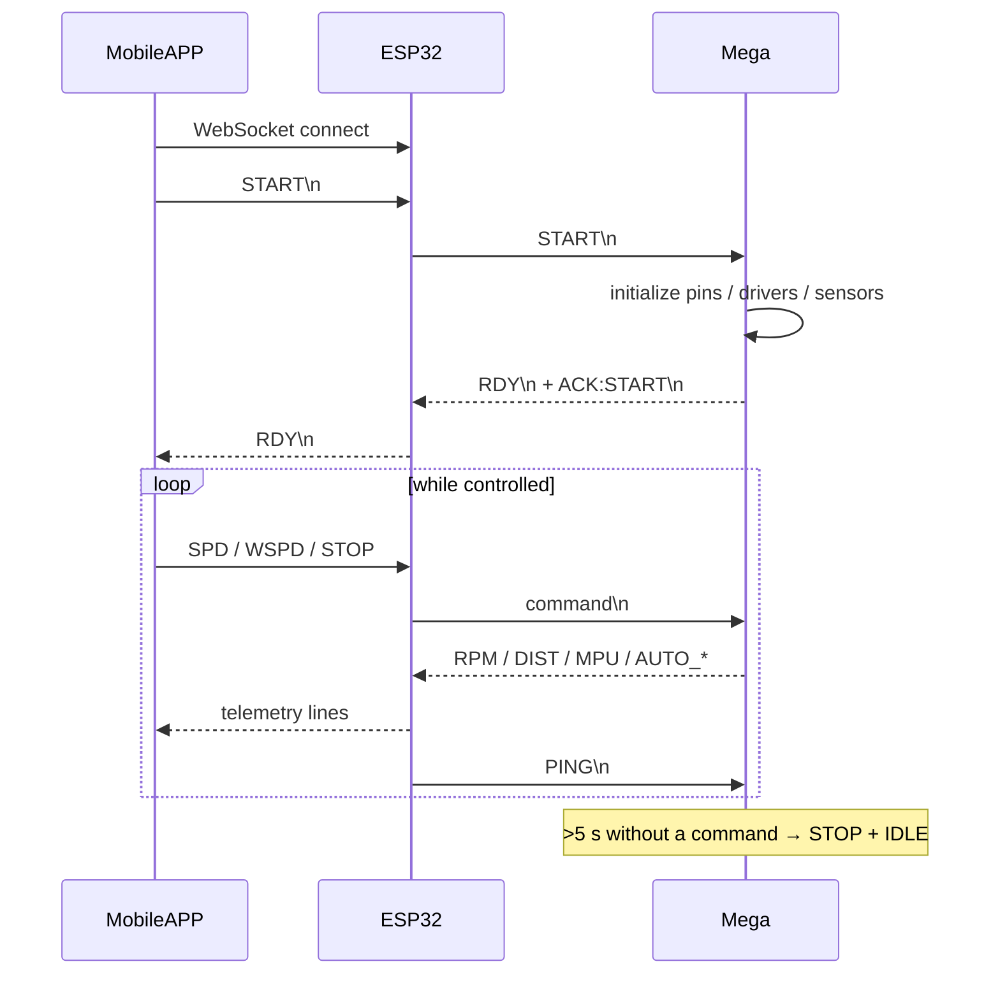
```mermaid
sequenceDiagram
    participant UI as MobileAPP
    participant E as ESP32
    participant M as Mega
    UI->>E: WebSocket connect
    UI->>E: START\n
    E->>M: START\n
    M->>M: initialize pins / drivers / sensors
    M-->>E: RDY\n + ACK:START\n
    E-->>UI: RDY\n
    loop while controlled
        UI->>E: SPD / WSPD / STOP
        E->>M: command\n
        M-->>E: RPM / DIST / MPU / AUTO_*
        E-->>UI: telemetry lines
        E->>M: PING\n
    end
    Note over M: >5 s without a command → STOP + IDLE
```

### 8.5 Runtime states

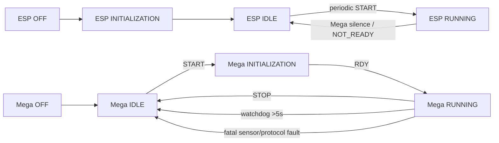
```mermaid
flowchart LR
    EOFF[ESP OFF] --> EINIT[ESP INITIALIZATION]
    EINIT --> EIDLE[ESP IDLE]
    EIDLE -->|periodic START| ERUN[ESP RUNNING]
    ERUN -->|Mega silence / NOT_READY| EIDLE

    MOFF[Mega OFF] --> MIDLE[Mega IDLE]
    MIDLE -->|START| MINIT[Mega INITIALIZATION]
    MINIT -->|RDY| MRUN[Mega RUNNING]
    MRUN -->|STOP| MIDLE
    MRUN -->|watchdog >5s| MIDLE
    MRUN -->|fatal sensor/protocol fault| MIDLE
```

### 8.6 Protocol hardening backlog

- Remove the ESP32’s blind “assumed ready” fallback; `RUNNING` must require a real `RDY` or an explicit compatibility mode used only in simulation.
- Validate every forwarded `MPU` frame field count and numeric range before exposing it to the UI.
- Add a protocol version/capabilities frame so app and firmware mismatches are visible.
- Add sequence numbers and optional CRC/framing before adding a high-level SBC or long noisy cable.
- Make relay leader disconnect send `STOP`; make direct ESP32 mode use a control lease or single-client policy.
- Define a single shared protocol schema generated for C++ and TypeScript to prevent drift.

### 8.7 Target ROS 2 ↔ MCU contract

The Pi-to-robot bridge should first use the existing ESP32 WebSocket endpoint so the current gateway, heartbeat and Mega watchdog remain in the path. A later wired USB/UART transport may improve determinism, but it must preserve the same adapter interface and failure semantics.

| ROS interface | Direction | Contract |
|---|---|---|
| `/cmd_vel` (`geometry_msgs/Twist`) | Pi → `asar_safety` → gateway | Bounded body velocity; zero on timeout; never forwarded directly to PWM. Differential mode initially permits `linear.x` and `angular.z`; lateral motion is rejected until Mecanum kinematics is proven. |
| `/asar/telemetry/rpm` | Mega → ESP32 → Pi | Timestamped per-side or per-wheel signed speed; calibration revision included in the bag metadata. |
| `/asar/telemetry/distances` | Mega → ESP32 → Pi | L/F/R/B ultrasonic values with validity flags; a missing echo is not a zero-centimetre obstacle. |
| `/asar/telemetry/imu` | Mega → ESP32 → Pi | Raw/filtered values plus frame, timestamp and calibration status; do not fuse uncalibrated axes. |
| `/odom` | Pi localization | Wheel/IMU estimate in `odom → base_link`; covariance must be populated before EKF/Nav2 acceptance. |
| `/scan` | LiDAR driver → SLAM/Nav2 | Calibrated `laser` frame, monotonic timestamps, known range limits and a documented QoS profile. |
| `/camera/image_raw` + `/camera/camera_info` | Camera driver → vision | Image encoding, exposure/FPS and calibration file are versioned with the run. |
| `/detections` (`vision_msgs/Detection2DArray`) | Vision → decision/fusion | Class, confidence, timestamp, source frame and optional track ID; one frame cannot force an emergency maneuver alone. |
| `/asar/decision` | SLM/policy → safety governor | Schema-validated allow-list action with TTL, source/model hash and reason code; no PWM, pin, shell or network tool fields. |
| `/diagnostics` + rosbag2 | Every target node → evidence | Health, latency, dropped frames, model/runtime version and fallback reason are recorded. |

Required frame tree target: `map → odom → base_link`, with calibrated `laser` and `camera_link` children. If a frame, timestamp or covariance is missing, the safety governor must hold/stop instead of guessing.

## 9. Algorithms and control logic

### 9.1 Joystick differential mixer

The current `JoystickControl.tsx` converts drag displacement into signed left/right speeds, applies a 10-unit deadband, clamps each side to `[-255,255]`, and throttles command sends to about 50 ms. Its current sign convention is:

```text
left  = clamp((−dragY + dragX) × 255 / 80, −255, 255)
right = clamp((−dragY − dragX) × 255 / 80, −255, 255)
```

Implementation requirements:

- preserve the deadband so the robot does not creep at joystick center;
- normalize the pair if a future input source can push one side over 255;
- send a zero command immediately on drag end;
- rate-limit only ordinary motion frames, never `STOP`;
- expose current command and measured RPM together so an operator can distinguish “commanded” from “achieved.”

### 9.2 Motor mapping, inversion and ramping

The Mega maps signed side values to direction pins and PWM. It clamps against `maxSpeed`, applies `MIN_PWM=70` for non-zero motion, and ramps toward the target every 20 ms by `RAMP_STEP=4`. Four inversion flags permit per-wheel polarity correction. `WSPD` bypasses the side ramp path for explicit per-wheel calibration and then synchronizes the side motor state.

Calibration procedure:

1. Put the robot on a stand and set `MAX_SPD` low.
2. Run one wheel forward; record physical direction and encoder tick sign.
3. Use `INV_CFG` to correct polarity, then repeat in reverse.
4. Save the resulting flags and wheel labels in the Team Hub evidence record.
5. Only after all four wheels agree should `SPD` or `WSPD` be used on the floor.

### 9.3 Encoder RPM and odometry

The current Mega computes side RPM approximately as:

```text
RPM = (delta_ticks / encoder_pulses_per_rev) / (elapsed_ms / 60000)
```

Current constants are `ENCODER_PULSES_PER_REV=20`, `WHEEL_DIAMETER_MM=65`, `WHEEL_BASE_MM=150`. These are code defaults, not measured confirmation. The odometry update uses:

```text
distance_left  = delta_left_ticks  × π × wheel_diameter / pulses_per_rev
distance_right = delta_right_ticks × π × wheel_diameter / pulses_per_rev
distance_center = (distance_left + distance_right) / 2
delta_heading   = (distance_right - distance_left) / wheel_base
```

Then it integrates planar `x`, `y`, `theta` and wraps heading to `[-π,π]`. Acceptance requires measuring PPR and wheel dimensions, checking sign, and comparing a known-distance run against odometry. If all four Mecanum wheels are used independently, replace this estimator with a four-wheel model; do not call the two-side output “Mecanum odometry.”

### 9.4 Motor stability locks

The Mega enables a straight lock when `leftSpeed == rightSpeed` and a rotation lock when `leftSpeed == -rightSpeed`. A PID-like correction uses either MPU `gz` or left/right tick differences, clamps the bias and modifies the two side targets. This is a stabilizer, not a complete velocity PID: it has no independently measured wheel velocity loop for each motor.

Acceptance metrics:

- straight run heading drift over a fixed distance;
- left/right RPM mismatch under equal command;
- settling time after a step command;
- correction bias saturation frequency;
- behavior when the IMU is absent and the tick-difference fallback is used.

### 9.5 Ultrasonic sensing and obstacle warning

Current behavior:

1. One of four sensors is sampled every 40 ms in a rotating index.
2. `pulseIn` waits up to 7 ms for an echo; `0` means timeout.
3. Each sensor has a five-sample median buffer.
4. Values above 250 cm or no-echo become a clear placeholder and are reported as zero.
5. Every 200 ms the Mega emits `DIST:L:F:R:B`.
6. Any valid distance `<= warningDistanceCm` (default 25 cm) activates a 160 ms warning blink/pulse; the warning clears when all valid sensors are clear.

Required improvements:

- replace `pulseIn` with a non-blocking trigger/echo state machine if command latency or cross-talk is observed;
- stagger sensor windows and validate each sensor’s direction with a known target;
- rate-limit repeated `ERR:SENSOR_FRONT_BLIND` frames;
- make the app threshold match the Mega threshold instead of hard-coding `<30 cm` in the UI;
- record no-echo, saturation and cross-talk rates rather than only the median value.

### 9.6 MPU-6050 filtering

The Mega reads 14 bytes from the `0x68` device and applies a fixed-point low-pass blend, then holds the stable value until the filtered change exceeds the configured axis threshold. Defaults are:

| Parameter | Default | Valid range |
|---|---:|---:|
| Accelerometer threshold | 1200 | 50–8000 |
| Gyroscope threshold | 180 | 10–4000 |
| Blend percentage | 25 | 5–95 |
| Report interval | 220 ms | 50–1000 ms |

For a raw axis `x`, filtered fixed-point state `F`, stable output `S` and blend `α`:

```text
F_next = F + α × (x − F)
output = S                  if |F_next − S| <= threshold
         F_next              otherwise, then S = F_next
```

This is a vibration-suppression filter, not a calibrated attitude estimator. A complementary filter or EKF belongs in a future layer after axis calibration, timestamping and covariance measurements exist.

### 9.7 Reactive autopilot FSM

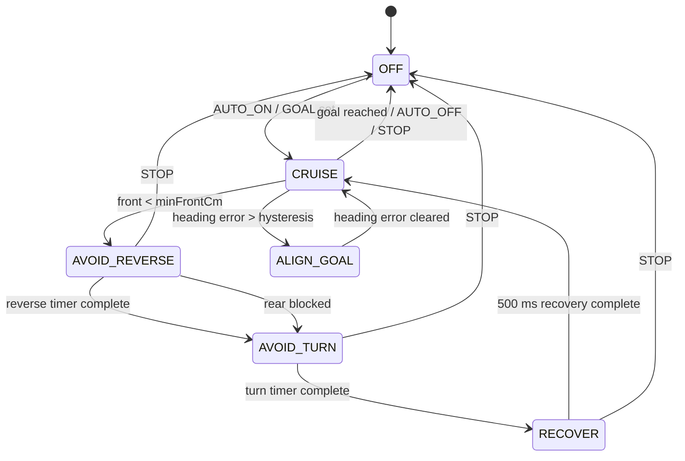
```mermaid
stateDiagram-v2
    [*] --> OFF
    OFF --> CRUISE: AUTO_ON / GOAL set
    CRUISE --> AVOID_REVERSE: front < minFrontCm
    AVOID_REVERSE --> AVOID_TURN: reverse timer complete
    AVOID_REVERSE --> AVOID_TURN: rear blocked
    AVOID_TURN --> RECOVER: turn timer complete
    RECOVER --> CRUISE: 500 ms recovery complete
    CRUISE --> ALIGN_GOAL: heading error > hysteresis
    ALIGN_GOAL --> CRUISE: heading error cleared
    CRUISE --> OFF: goal reached / AUTO_OFF / STOP
    AVOID_REVERSE --> OFF: STOP
    AVOID_TURN --> OFF: STOP
    RECOVER --> OFF: STOP
```

Current defaults/ranges are validated in `parseAutoConfig()`; keep them in the plan’s release record when tuned. The algorithm uses front/rear/side distances, reverses from a front obstacle, chooses a turn direction from free side space, recovers forward, and optionally blends goal heading with side-obstacle repulsion. It is reactive local behavior, not map-based global navigation.

### 9.8 Complete target algorithm stack, in implementation order

1. **Per-wheel velocity feedback:** derive four wheel RPM values and add bounded PI/PID loops.
2. **Mecanum inverse/forward kinematics:** body velocity interface, per-wheel normalization and calibrated sign matrix.
3. **Timestamped sensor fusion:** synchronize wheel/IMU streams and quantify noise.
4. **Complementary filter:** stabilize roll/pitch/yaw-rate demonstrations before EKF.
5. **EKF:** fuse wheel odometry and IMU; add LiDAR only after the frame tree and timebase are correct.
6. **LiDAR SLAM:** publish a calibrated `/scan`, fuse it with timestamped odometry in `slam_toolbox`, validate map/pose quality, then provide the map and pose to Nav2.
7. **Nav2:** use global/local costmaps, a planner/controller and recoveries; route every velocity through `asar_safety`, cap speed and stop on stale sensor or command data.
8. **Camera vision:** calibrate intrinsics/extrinsics, rectify, run a lightweight quantized detector, track across frames and publish `vision_msgs`; use LiDAR/TF association only after timing and frame tests pass.
9. **Perception-assisted navigation:** let confirmed detections influence costmaps or bounded behavior requests; do not let a one-frame detection directly command a motor.
10. **Edge SLM decisions:** compress the world into structured state, produce an allow-listed JSON decision, validate it and hand it to Nav2/safety. A malformed, stale, slow or low-confidence answer falls back to deterministic behavior.
11. **Scenario evaluation:** replay bags and run the same map, navigation, vision and SLM policy tests in simulation/bench/floor environments before a live demo.

## 10. Complete target autonomy platform

This is the full intended ASAR autonomy layer. It is deliberately concrete so the team can buy, mount, implement, benchmark and accept each part without confusing a concept image with an installed capability.

### 10.1 Target hardware and physical integration

| Target item | Design intent | Selection / installation gate |
|---|---|---|
| Raspberry Pi | Pi 5, 8 GB target; 64-bit OS; active cooling; SSD/NVMe or high-endurance storage for bags and model files. Pi 4 remains a benchmark fallback, not an assumed equivalent. | Measure idle/peak current, CPU/RAM/thermal headroom while LiDAR, camera, Nav2 and the chosen runtime are active. |
| Pi power | Separate regulated 5 V rail sized from the measured Pi + USB/CSI + accelerator load, with fuse and low-voltage behavior documented. | Never assume the Mega/L298N rail can supply the Pi; test brownout, reboot and clean shutdown behavior. |
| LiDAR | 2D scanning LiDAR with a maintained ROS 2 driver, known voltage/current, range/scan rate and a clear 360° or planned field of view. | Record exact model, serial/firmware, driver/package version and `laser` mount transform. Keep the head above chassis occlusions and away from flexing brackets. |
| Camera | Rigid CSI or USB RGB camera; fixed exposure/FPS profile where possible; optional RGB-D/stereo only if the compute and calibration budget supports it. | Record resolution, encoding, FPS, latency, intrinsics, distortion and `camera_link` extrinsics. No hand-held camera evidence counts as system calibration. |
| Optional accelerator | USB/PCIe NPU or GPU only if the Pi CPU benchmark misses the perception/SLM latency budget. | Add it only after profiling; record driver, memory, power and fallback-to-CPU behavior. |
| Mounting/harness | Mechanical bracket must not move relative to `base_link`; Pi, LiDAR and camera cables need strain relief and EMI separation from motor wiring. | Photograph the installed pose, measure sensor heights/offsets and repeat calibration after any impact or chassis change. |

The existing robot photographs are useful physical evidence for the chassis, four-wheel layout and sensor positions. The packaged future-navigation image is illustrative only:

<figure>
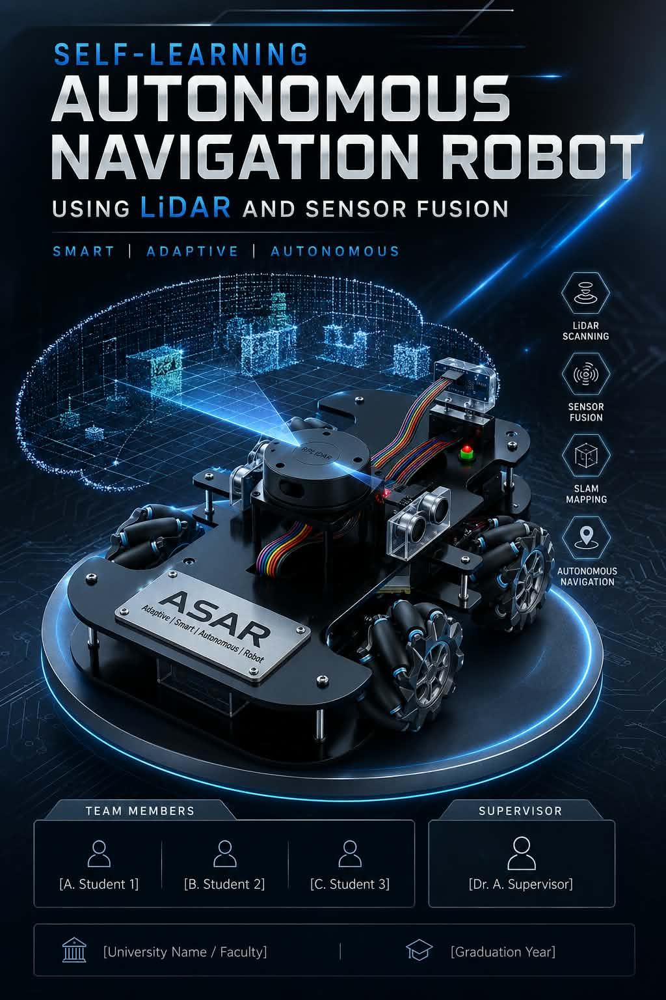
<figcaption>Conceptual target visual from the presentation; it is not proof that Pi, ROS 2, LiDAR or vision are installed.</figcaption>
</figure>

### 10.2 ROS 2 target package and data flow

The Pi should run one bring-up launch with lifecycle/health ordering: description and static transforms → gateway and odometry → LiDAR/camera drivers → localization/SLAM → Nav2 → vision → decision and safety. Every process must expose diagnostics and a shutdown path.

The target topic/frame contract is defined in Section 8.7. The important ownership rule is:

```text
operator teleop ─┐
Nav2 controller ──┼─> asar_safety governor ─> cmd_vel/STOP ─> asar_gateway
edge SLM policy ──┘                                      └─> ESP32 -> Mega
```

No ROS node, model or script may write Mega pins, PWM, L298N inputs or a raw `WSPD` frame directly. The gateway converts only an accepted, bounded command into the existing safe transport; the Mega still applies range checks, ramping, obstacle rules and its watchdog.

### 10.3 LiDAR, localization, SLAM and Nav2 process

1. Calibrate wheel diameter, wheelbase/roller geometry, encoder sign/PPR, IMU axes/bias and sensor timestamps. For true Mecanum motion, implement and test the four-wheel inverse/forward kinematic matrix before publishing lateral odometry.
2. Publish `odom → base_link` from wheel/IMU estimation. Use `robot_localization`/EKF only after covariance, frame and timestamp tests are real; do not hide poor calibration behind a filter.
3. Publish LiDAR data in a fixed `laser` frame with a verified static transform. Check scan frequency, range limits, invalid returns and timestamp monotonicity.
4. Run `slam_toolbox` for mapping and save the map plus all calibration/parameter revisions. Validate loop closure, repeated-start pose error, corridor drift and dynamic-obstacle behavior.
5. Switch to localization against a saved map only after mapping is repeatable. Feed map/pose to Nav2 costmaps and planner/controller; keep local obstacle behavior available when the map or Pi is unavailable.
6. Let Nav2 send only through `asar_safety`. A stale scan, missing TF, lost odometry, failed lifecycle node or command timeout produces a bounded stop/hold and a visible diagnostic.

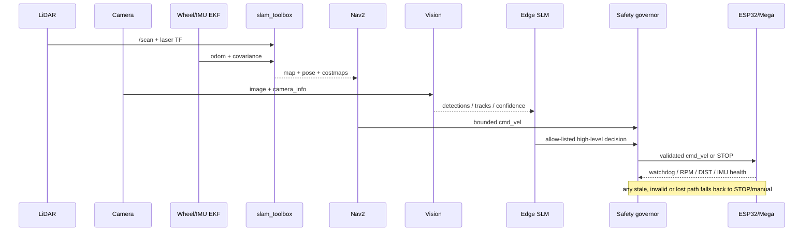
```mermaid
sequenceDiagram
    participant L as LiDAR
    participant C as Camera
    participant E as Wheel/IMU EKF
    participant S as slam_toolbox
    participant N as Nav2
    participant V as Vision
    participant D as Edge SLM
    participant G as Safety governor
    participant X as ESP32/Mega
    L->>S: /scan + laser TF
    E->>S: odom + covariance
    S-->>N: map + pose + costmaps
    C->>V: image + camera_info
    V-->>D: detections / tracks / confidence
    N->>G: bounded cmd_vel
    D->>G: allow-listed high-level decision
    G->>X: validated cmd_vel or STOP
    X-->>G: watchdog / RPM / DIST / IMU health
    Note over G,X: any stale, invalid or lost path falls back to STOP/manual
```

### 10.4 Camera and vision pipeline

The first camera objective is deterministic semantic perception, not an unconstrained end-to-end AI driver:

1. Calibrate intrinsics and distortion with a printed target; store the calibration matrix, distortion coefficients, image size and date in the repository or controlled artifact.
2. Measure the camera-to-robot extrinsic transform relative to `base_link`; publish `camera_link` and optical frames through `tf2`.
3. Capture a versioned dataset across the intended lighting, floor, obstacle, distance, motion-blur and occlusion conditions. Store labels and train/validation/test splits separately so test images are not tuned against.
4. Start with a lightweight detector exported to ONNX or TFLite and benchmark actual Pi inference. Publish `vision_msgs/Detection2DArray` with class, confidence, timestamp, source frame and optional track ID.
5. Add temporal tracking (a simple Kalman/association tracker is sufficient for the first version) to suppress one-frame noise. A detection can affect navigation only after confidence, persistence, range/TF and safety checks pass.
6. If a detection must have distance, associate it with LiDAR or depth only when the timestamp/extrinsic error is within the recorded bound. Otherwise report “class only” and let the safety governor choose a conservative behavior.

Minimum vision metrics: class precision/recall or mAP on a held-out set, false-positive/false-negative counts for safety-relevant classes, FPS, p50/p95 end-to-end latency, dropped-frame rate, range error when fused and false-stop rate in clean scenes.

### 10.5 Edge SLM decision-making contract

Here “edge SLM” means a small language model running locally on the Pi for high-level, explainable mission decisions. It is not the perception engine and it is not a motor controller.

**Input.** The decision node provides a compact, schema-versioned world state: mission/operator intent, current Nav2 state, approved goal IDs, pose confidence, free-space/obstacle summary, confirmed vision tracks, battery/health, recent events and available recovery actions. Raw images are handled by the vision node; raw motor values, shell commands, network tools and secrets are never part of the model context.

**Model/runtime.** Start by benchmarking a quantized model in the approximate 0.5–1.5B parameter class using a local CPU/accelerator runtime such as llama.cpp or ONNX Runtime. This is a benchmark range, not a purchase commitment. Record model file hash, quantization, context length, prompt/schema revision, memory peak, tokens/sec and p50/p95 response latency.

**Output.** Constrain decoding to a JSON schema and validate it again in code. The first allow-list should be deliberately small:

```json
{
  "action": "SET_APPROVED_GOAL | PAUSE | SLOW | RESUME | REQUEST_OPERATOR | RECOVER",
  "goal_id": "approved_waypoint_or_null",
  "speed_limit_mps": 0.0,
  "ttl_ms": 1000,
  "reason_code": "short_enum",
  "confidence": 0.0
}
```

The policy validator rejects unknown actions, unapproved goal IDs, speeds above the current cap, expired TTLs, missing fields, non-finite numbers and low-confidence decisions. Valid output is still only a request to Nav2/`asar_safety`; it cannot disable collision handling, the Mega watchdog, the physical cutoff or manual STOP.

**Fallback.** If the model process crashes, times out, emits malformed JSON, returns an unsafe action or receives stale perception, the decision node emits a diagnostic and falls back to deterministic Nav2 recovery, onboard reactive behavior or manual control. If the safety governor cannot establish a healthy command source, it sends STOP.

**Evaluation.** Test ordinary scenarios, adversarial/ambiguous descriptions, prompt-injection-like sensor strings, missing topics, contradictory detections and model restarts. Acceptance requires 100% schema validity in the test corpus, zero unsafe actuation paths in static/fault tests, bounded p95 latency for the selected decision class, complete audit records and successful deterministic fallback.

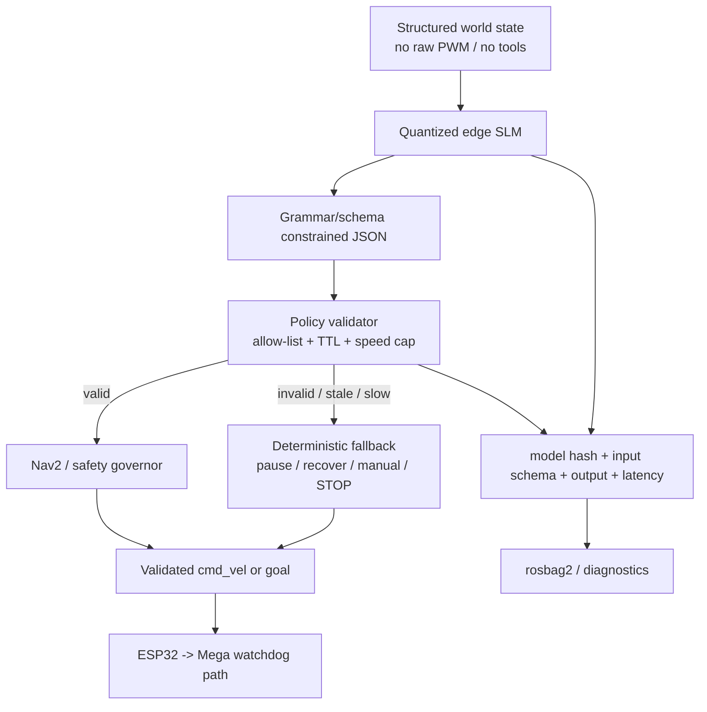
```mermaid
flowchart TD
    STATE[Structured world state<br/>no raw PWM / no tools] --> MODEL[Quantized edge SLM]
    MODEL --> JSON[Grammar/schema constrained JSON]
    JSON --> VALID[Policy validator<br/>allow-list + TTL + speed cap]
    VALID -->|valid| ROUTE[Nav2 / safety governor]
    VALID -->|invalid / stale / slow| FALLBACK[Deterministic fallback<br/>pause / recover / manual / STOP]
    ROUTE --> CMD[Validated cmd_vel or goal]
    CMD --> MCU[ESP32 -> Mega watchdog path]
    FALLBACK --> CMD
    EVID[model hash + input schema + output + latency] --> LOG[rosbag2 / diagnostics]
    MODEL --> EVID
    VALID --> EVID
```

### 10.6 Target autonomy acceptance matrix

| ID | Target test | Pass evidence |
|---|---|---|
| T21 | Pi boot, storage, cooling and power-loss test. | Reproducible image; measured current/temperature; clean restart; no motor motion during Pi reboot. |
| T22 | ROS gateway bridge with motors disconnected. | `START/RDY`, telemetry, bounded `cmd_vel`, bridge timeout and STOP capture. |
| T23 | Frame and odometry validation. | `map → odom → base_link`, sensor transforms, timestamps and covariance pass a recorded checklist. |
| T24 | LiDAR driver and scan quality. | Stable `/scan`, correct orientation/range, no unexpected USB/serial drops, known latency. |
| T25 | Mapping/relocalization repeatability. | Multiple maps/runs with recorded drift, loop closure and start-pose error within team threshold. |
| T26 | Nav2 goal, obstacle and recovery behavior. | Goals complete or fail safely; stale scan/TF/command produces hold/STOP; local Mega safety remains active. |
| T27 | Camera calibration and timing. | Calibration reprojection record, fixed frame transform, FPS/latency/drop metrics. |
| T28 | Vision detector/tracker. | Held-out precision/recall or mAP, class confusion, p95 latency and false-stop record. |
| T29 | LiDAR/camera association. | Known target range/TF error, timestamp alignment and behavior when either sensor disappears. |
| T30 | SLM schema and adversarial policy test. | All outputs valid or rejected; no raw-actuation fields accepted; model hash and decision log present. |
| T31 | Fault injection. | Pi loss, LiDAR loss, camera loss, SLM crash, malformed output and ESP32/Mega link loss all reach the specified safe state. |
| T32 | Full mission scenarios. | At least five repeatable runs per scenario, bag/log evidence, operator override and comparison to deterministic baseline. |

Target gates: **G8** Pi/ROS/bridge, **G9** frames and odometry, **G10** LiDAR SLAM, **G11** Nav2, **G12** camera vision, **G13** edge SLM, **G14** full-system safety and mission acceptance. A later gate cannot waive an earlier failed safety gate.

## 11. Suggestions, improvements and warnings

This section is my design-review opinion about where ASAR can become more reliable, serviceable and easier to learn from. These are not automatically requirements. Adopt a suggestion only after an owner records the decision, the measured reason, the cost/availability impact and the rollback path. `[RECOMMENDED]` means “worth benchmarking”; it does not mean “buy it immediately.”

### 11.1 Component and hardware improvements

| Area | Current position | `[RECOMMENDED]` improvement | Alternative / decision trigger | Warning |
|---|---|---|---|---|
| Motor drivers | Two L298N boards are present in the current pin map. | Benchmark a modern MOSFET H-bridge with current sensing and a proper standby/brake input. Keep L298N only if measured stall current, voltage drop and temperature are acceptable for the intended duty cycle. | For lower-current motors, a TB6612FNG-class dual driver is a candidate; for higher current, use a protected external H-bridge from a reputable motor-driver vendor. Select from measured continuous/stall current, not the advertised peak number. | L298N heat and voltage loss can consume the motor/power budget. Do not change the driver pin map until a replacement schematic and bench test exist. |
| Battery and power distribution | Presentation/legacy material suggests 3S and LM2596/5 V/9 V rails, but the executable repository has no measured power budget. | Use a fused power-distribution point after the master cutoff, separate motor and logic branches, a dedicated Pi rail, per-branch fuses and voltage/current telemetry. | A different battery chemistry or 4S pack is possible only after every driver, buck, fuse, BMS and motor rating is requalified. | Never connect the Pi or sensors to an unmeasured motor rail. A Pi 5 target should have a regulated 5 V rail sized around the official 5 V/5 A recommendation, with cable drop and USB/accelerator load measured. |
| Wheel feedback | Current Mega odometry is side-based; it does not independently measure all four wheel speeds. | Add four independent quadrature channels or a dedicated encoder interface, then close per-wheel velocity loops before claiming accurate Mecanum motion. | If the current encoder hardware cannot provide four reliable channels, use an external counter board or operate explicitly as differential drive. | A four-wheel chassis without four-wheel feedback can hide slip, roller mismatch and a stalled wheel. |
| IMU | MPU-6050 is implemented and useful for baseline telemetry. | Keep it for baseline compatibility, but benchmark a newer IMU such as ICM-42688-class or BMI270-class hardware for lower-noise, better-supported target fusion. | Use a fused-output device such as BNO085-class hardware only if its timing, calibration persistence and driver support are acceptable; otherwise keep raw IMU data and fuse on the Pi. | Do not replace an IMU just for a higher part number. Axis convention, mounting rigidity, bias, covariance and timestamps matter more than the label. |
| Close obstacle sensing | Four HC-SR04 inputs provide the current local warning path. | Keep them as a redundant close-range safety layer, but add bumper switches or short-range ToF where acoustic cross-talk/soft surfaces are a problem. Use LiDAR for geometry and mapping, not HC-SR04. | A ToF array can improve compact near-field coverage; a bumper is the simplest last-resort contact sensor. | Ultrasonic `0`/no-echo, transparent objects, angled surfaces and cross-talk must be represented as invalid/unknown—not as a confident clear path. |
| Raspberry Pi storage and cooling | Pi is a target tier, not current verified hardware. | Use active cooling, high-endurance storage and preferably NVMe/SSD for repeated rosbag/model writes; keep an image backup and a read-only recovery procedure. | A high-endurance microSD is acceptable for bring-up only if bag volume and write endurance are measured. | Storage corruption or thermal throttling must never leave the Mega with a stale motion command; the safety path must be independent. |
| Camera | Camera/vision is a target capability with no current stream. | Start with a rigid CSI camera when latency and mechanical integration matter; use a UVC USB camera when interchangeability and development speed matter more. | RGB-D/stereo is justified only if range/occlusion requirements cannot be met by 2D LiDAR plus RGB. | Camera placement must be a calibrated datum. A hand-held or flexible mount invalidates the extrinsic transform after vibration. |
| LiDAR | Exact model and driver are not selected. | Prefer a 2D scanner with a maintained ROS 2 driver, documented serial/USB behavior, timestamp access, known minimum range and a mount that exposes the intended scan plane. | Compare several models in a short indoor test for scan dropouts, glass/black-surface behavior, range and CPU load before purchase. | Do not buy from range alone. ROS driver maturity, cable level, power draw, scan latency and physical occlusion are acceptance criteria. |
| Connectors and serviceability | Existing prototype wiring is still being reconciled. | Replace loose breadboard/jumper paths with locking connectors, labeled harness branches, strain relief, keyed polarity and a service disconnect for each major rail. | Use screw terminals only where vibration and accidental shorting are controlled; use crimped locking connectors for removable sensors/motors. | A correct schematic does not protect against a reversed connector. Label both ends and photograph the actual harness revision. |

The component default I would use is: retain the current boards for controlled baseline characterization, improve the power distribution and safety wiring first, then replace the motor driver and add four-wheel feedback only when measured current and encoder access justify the change. This preserves learning value and avoids buying a “better” part that cannot be integrated or verified.

### 11.2 Mechanical improvements

- Make the LiDAR and camera bracket a rigid, replaceable datum plate tied to the chassis frame. Put dowel/pin features or repeatable hard stops on the bracket so calibration can be restored after removal.
- Put battery and motor drivers low and near the chassis center; keep the Pi, storage and sensor connectors accessible on the upper deck without placing a tall mast over the LiDAR scan plane.
- Add a protected sensor mast or guard that does not enter the LiDAR field of view. Record `base_link` offsets with a ruler/CAD drawing, not only a photograph.
- Measure wheel axle parallelism, wheel diameter under load, roller orientation, wheelbase and track width. For Mecanum, shim mounts until all wheels share a plane and contact load.
- Add a bumper/contact envelope around the chassis. It provides a deterministic last-resort signal when LiDAR or camera perception is confused.
- Prefer a modular deck with captive fasteners and labeled harness channels over permanent glued mounts. The autonomy tier will require repeated sensor removal during calibration.
- If the team needs reliable early demonstrations rather than lateral motion, keep a differential-drive wheel option or explicitly lock the current Mecanum chassis into a differential operating mode until M8 passes.

### 11.3 Wiring, power and signal improvements

Recommended electrical hierarchy:

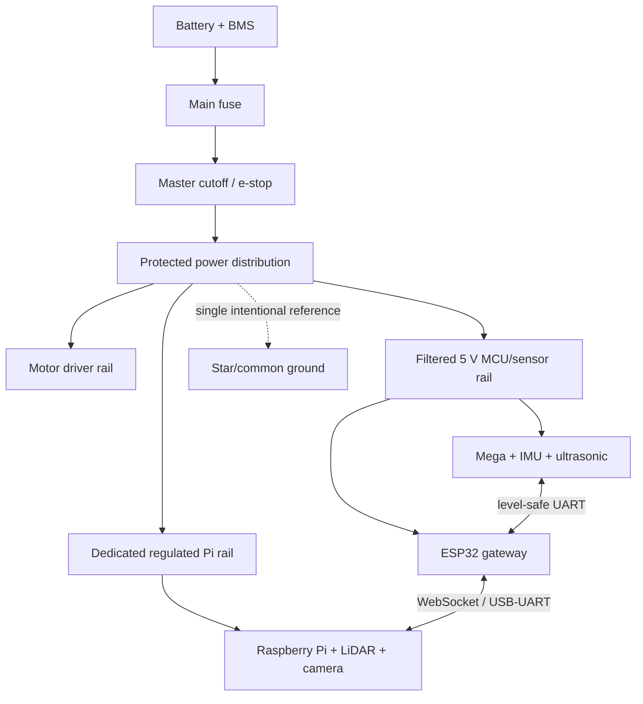
```mermaid
flowchart TD
    BAT[Battery + BMS] --> FUSE[Main fuse]
    FUSE --> KILL[Master cutoff / e-stop]
    KILL --> PDB[Protected power distribution]
    PDB --> VMOT[Motor driver rail]
    PDB --> B5[Filtered 5 V MCU/sensor rail]
    PDB --> BPI[Dedicated regulated Pi rail]
    B5 --> MEGA[Mega + IMU + ultrasonic]
    B5 --> ESP[ESP32 gateway]
    BPI --> PI[Raspberry Pi + LiDAR + camera]
    MEGA <-->|level-safe UART| ESP
    ESP <-->|WebSocket / USB-UART| PI
    PDB -.->|single intentional reference| GND[Star/common ground]
```

Apply these wiring improvements before high-speed or autonomous tests:

1. Put the main fuse and physical cutoff before all branches. Size the fuse from measured stall/inrush behavior and document the interrupt rating.
2. Give motors, Mega/ESP32 logic, and Pi/peripherals separate regulated branches. Join grounds at a deliberate distribution point; do not let motor return current share thin sensor traces.
3. Add bulk capacitance near motor drivers and local ceramic/bulk decoupling at the Pi, ESP32, IMU and LiDAR. Validate ripple and brownout behavior with a scope or logged rail measurement.
4. Treat Mega 5 V TX → ESP32 3.3 V RX as unsafe until a level-safe interface is installed and measured. Use a direction-appropriate translator or validated divider/buffer, not an unexamined “bidirectional I2C” module for UART.
5. Twist each motor pair, route motor power away from UART/I2C/encoder lines, keep echo wires short, and add shielding/filtering only after the grounding strategy is understood. Shield drains must have one documented termination rule.
6. Add a hardware-visible power-good/low-voltage signal to the Pi and log it. Pi software should refuse autonomy when the measured rail is outside the allowed range.
7. Add a service loop and keyed connector for every sensor. A cable that can be inserted backwards is a design defect, even if the pinout is documented.
8. Keep the physical cutoff accessible while the robot is moving. A software STOP is a control path; it is not a substitute for removing energy.

### 11.4 Software and development-tool improvements

| Need | My default recommendation | Alternative | Adoption warning |
|---|---|---|---|
| MCU builds | PlatformIO with pinned board/framework versions, reproducible environments and CI compile checks; retain Arduino IDE for first bring-up. | CMake/arduino-cli for teams that already have a disciplined command-line build. | Do not migrate the critical first-power test and firmware logic at the same time. |
| ROS workspace | Native 64-bit ROS 2 workspace with `colcon`, `rosdep`, a checked-in `.repos`/dependency manifest, pinned parameters and a single bring-up launch. | Docker/Podman for reproducible development on workstations; use native services on the Pi if container overhead complicates camera/GPIO/USB access. | Containers do not solve bad TF, timing or power. Record device permissions and USB rules. |
| Simulation | Gazebo-compatible ROS 2 simulation for URDF, topics, Nav2 and failure scenarios; use the same message/frame names as hardware. | Webots for a lighter educational path; Isaac Sim only if the team has the GPU/time budget and the simulation result is worth its cost. | Simulation validates software behavior, not motor current, EMI, wheel friction or emergency-stop timing. |
| Telemetry review | rosbag2 plus PlotJuggler or Foxglove-style visualization for timestamped plots, TF and event correlation. | CSV export + Python/NumPy/Pandas for small, controlled experiments. | Do not tune filters from a live dashboard without saving the raw stream and calibration revision. |
| Vision runtime | OpenCV for calibration/preprocessing and a quantized ONNX Runtime or TFLite detector; benchmark the actual Pi before adding an accelerator. | A vendor NPU runtime when CPU latency/power is the measured bottleneck. | Model conversion can change preprocessing, class order and confidence semantics; test the exported artifact, not only the training checkpoint. |
| Edge SLM runtime | Local llama.cpp/ONNX-class runtime with constrained JSON/grammar output and a separate validator process. | A deterministic behavior tree/state machine only; this is the preferred fallback and may be sufficient without an SLM. | No cloud LLM, free-form tool call or network dependency belongs in an immediate control loop. |
| Testing | Python tests for schemas/log analysis, C++/firmware compile checks, ROS launch/topic smoke tests, fault-injection scripts, clang-format/static checks and CI. | Hardware-in-the-loop rig with a motor power disconnect and simulated telemetry. | A green UI or simulation is not a hardware acceptance result. |
| Dataset/model records | A versioned scenario manifest containing calibration, map, labels, split, model hash, runtime and metrics. Use CVAT/Label Studio or an equivalent labeling tool if labels are needed. | A simpler CSV/JSON registry for the first small dataset. | Check dataset license, consent/privacy, train/test leakage and model redistribution terms before public demos. |
| Documentation/release | Markdown as source, Mermaid/SVG assets, generated DOCX, ADRs, Team Hub evidence and release tags. | A controlled wiki for team onboarding, with Markdown exports kept in Git. | Slide-only claims and unlinked screenshots must not become the only record of a safety decision. |
| Network exposure | Isolated robot LAN, authenticated relay, single-leader lease and disconnect STOP. | Direct local WebSocket for one trusted operator during bring-up. | Never expose the current unauthenticated direct endpoint or tunnel to the public internet. |

### 11.5 Algorithm and autonomy improvements

- **Control:** add per-wheel velocity feedback and bounded PI loops before sophisticated planning. Keep acceleration/jerk limits and a hard command timeout below the ROS stack.
- **Mecanum:** implement one explicit body-velocity convention (`v_x`, `v_y`, `omega_z`), a calibrated sign matrix, wheel normalization and independent wheel odometry. Reject `v_y` in the baseline rather than silently producing the wrong motion.
- **State estimation:** normalize timestamps and frames at the gateway, publish covariances, then use a Pi-side EKF. A filter should express uncertainty; it should not conceal a reversed encoder or a moving IMU mount.
- **Mapping:** use LiDAR-first 2D SLAM for the first repeatable map. Evaluate `slam_toolbox` against another ROS 2 option only if drift, loop closure, dynamic obstacles or CPU load fail the scenario threshold.
- **Navigation:** start with a conservative planner/controller and low speed cap, then add more advanced controllers such as MPPI only when the baseline’s costmaps, TF, odometry and recovery behaviors are stable.
- **Vision:** separate calibration, detection, tracking and decision. Require temporal persistence and confidence/range checks before a detection changes a costmap or high-level behavior.
- **SLM:** treat the model as a mission interpreter/recovery selector. Use approved goal IDs and policy actions rather than arbitrary coordinates; keep emergency stop, collision avoidance and watchdog behavior deterministic.
- **Evaluation:** replay the same bags through the baseline, Nav2-only and Nav2-plus-vision/SLM paths. Measure success, near misses, false stops, latency, compute load and fallback frequency.

### 11.6 Warnings and considerations

1. **Do not copy ratings from the slides.** Battery voltage, driver current, wheel diameter, encoder PPR, regulator capacity and sensor model must be measured or sourced from the exact part.
2. **Do not treat Wi-Fi as a safety link.** Lost Wi-Fi must result in a stop through the ESP32/Mega watchdog; it must not leave the last non-zero command alive.
3. **Do not let the SLM become a hidden actuator.** Its output must be schema-valid, allow-listed, time-bounded, logged and removable without disabling manual control.
4. **Do not use camera vision as the only emergency stop.** Keep a deterministic local obstacle layer, physical cutoff and watchdog even when the camera appears confident.
5. **Do not fuse uncalibrated sensors.** A wrong `laser`, `camera_link`, encoder sign or timestamp can make a visually plausible map actively dangerous.
6. **Watch the Pi power budget.** A Pi 5 with a 3 A supply can restrict peripheral power; LiDAR, camera, SSD and accelerator loads must be included in the rail test.
7. **Watch the battery energy path.** BMS protection is not a replacement for a fuse, cutoff, low-voltage policy or thermal inspection. Never charge an unknown pack on the robot.
8. **Watch mechanical vibration.** Loose LiDAR/camera/IMU mounts create stale calibrations and noisy perception that software tuning cannot repair.
9. **Watch licenses and privacy.** Camera datasets, pretrained models, labels, team photos and public tunnel logs need an ownership/consent rule before external sharing.
10. **Watch scope.** Build the complete architecture, but implement one evidence-backed vertical slice at a time: power → bridge → frames/odom → SLAM → Nav2 → vision → SLM.

### 11.7 Prioritized improvement backlog

| Priority | Improvement | Why first / exit evidence |
|---|---|---|
| P0 | Measure battery, stall current, rail voltage/ripple, fuse/BMS limits and Mega↔ESP32 logic levels; verify physical cutoff. | Prevents component damage and makes every later recommendation meaningful; closes G0. |
| P0 | Add a Pi-specific regulated branch and thermal/storage plan before installing ROS peripherals. | Prevents Pi brownouts and corrupted bags/models; closes the power part of G8. |
| P1 | Replace or qualify L298N based on measured current/temperature; document the chosen driver and pin map. | Removes a likely thermal/voltage-loss bottleneck without guessing; hardware test report required. |
| P1 | Make encoder feedback independently observable per wheel if Mecanum remains the target. | Required for truthful kinematics and odometry; closes the prerequisite for M8/M9. |
| P1 | Move firmware to reproducible builds and add protocol/schema regression tests. | Reduces drift before the Pi bridge creates more consumers. |
| P2 | Install rigid LiDAR/camera mounts, create URDF/TF calibration records and record rosbag2 evidence. | Makes SLAM/vision data physically meaningful; closes G9. |
| P2 | Implement ROS gateway + safety governor with bridge-loss STOP and manual override. | Ensures the Pi can be removed without losing safe control; closes G8/G11. |
| P3 | Build the camera dataset/calibration/detector benchmark and test degraded sensors. | Prevents an attractive but unmeasurable vision demo; closes G12. |
| P3 | Benchmark local SLM runtimes only after deterministic Nav2/manual behavior is accepted. | Makes SLM value measurable and keeps it outside the safety-critical path; closes G13. |
| P4 | Revisit custom PCB, accelerator, alternative battery chemistry and higher-current drivers. | These are worthwhile only when the measured bottleneck, budget and failure mode are known. |

Component references for the recommendations above: the [Raspberry Pi computer hardware/power documentation](https://www.raspberrypi.com/documentation/computers/raspberry-pi.html), [ST L298 product documentation](https://www.st.com/en/motor-drivers/l298.html), and [Toshiba TB6612FNG documentation](https://toshiba.semicon-storage.com/eu/semiconductor/product/general-purpose-logic-ics/detail.TB6612FNG.html). Their specifications are selection inputs, not permission to bypass the project’s measured current/thermal gate.

## 12. Validation strategy and phase gates

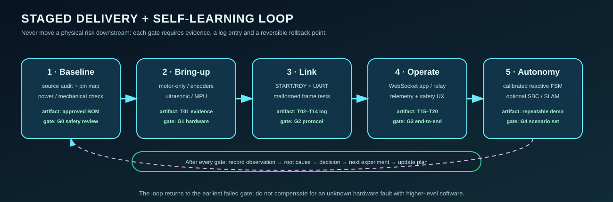

Use the [exploratory test map](#44-visual-operating-guides) to select a safe charter before running any new hardware, deployment, vision or edge-SLM experiment. The validation matrix below is the repeatable acceptance layer; exploratory observations must be promoted into it before they are treated as a gate result.

### 12.1 Test environment

- ESP32 DOIT DEVKIT V1; Arduino Mega 2560; two L298N boards; four motors/wheels; four HC-SR04 sensors; MPU-6050; encoder channels; buzzer; LED; verified power rails.
- Wheels lifted for all first motion and polarity tests.
- ESP32 USB serial at 115200, Mega USB serial at 115200, and a physical cutoff.
- Current firmware and exact test sketch revision recorded before each run.
- Optional logic analyzer for UART; optional current-limited supply for first power-up.

### 12.2 Gates

| Gate | Scope | Required exit evidence |
|---|---|---|
| G0 | Safety/readiness | Approved wiring drawing, measured rail voltages, cutoff/fuse/BMS check, source revision. |
| G1 | Motor/encoder/sensor bring-up | `T01`, encoder sign/PPR note, ultrasonic direction map, MPU I2C result. |
| G2 | UART/session/motion | `T02–T08`, captured `START/RDY`, STOP proof, command/range/error behavior. |
| G3 | Telemetry/diagnostics | `T09–T11C`, periodic frames, warning behavior, filtered MPU observation. |
| G4 | Robustness | `T12–T14`, overlength recovery, NOT_READY safe refusal, watchdog timeout. |
| G5 | App/relay end-to-end | `T15–T20`, direct and relay path, role behavior, telemetry widgets, reconnect/STOP. |
| G6 | Autonomy demo | repeatable scenario set, risk/phase logs, obstacle recovery, manual override. |
| G7 | Upgrade readiness | measured mechanical parameters, high-level board budget, protocol versioning, rollback plan. |

### 12.3 Test matrix

| ID | Procedure | Pass criterion |
|---|---|---|
| T01 | Isolated motor test, one wheel at a time. | Correct direction, no unintended cross-side movement, clean stop. |
| T02 | Power cycle both boards and observe handshake. | `START` → `RDY` within target; no blind ready claim. |
| T03 | Issue STOP during motion. | PWM zero / robot halts immediately. |
| T04 | HORN repeatedly. | One 300 ms action per command, no lockup. |
| T05–T08 | `SPD:120:120`, `SPD:-120:-120`, `SPD:80:180`, `SPD:180:80`. | Forward/reverse/left arc/right arc match the command convention. |
| T09 | Spin each encoder side by hand and under power. | Side, sign and magnitude are consistent with direction. |
| T10 | Place a known target in L/F/R/B positions. | `DIST:L:F:R:B` ordering and error are acceptable. |
| T11 | Move while monitoring RPM/DIST. | Periodic telemetry does not starve motion. |
| T11A | Put an obstacle within warning threshold. | Buzzer/LED warning activates and clears. |
| T11B | `MPU_REQ` stationary and under mild vibration. | Frame returns; jitter is reduced and no bus hang occurs. |
| T11C | `MPU_CFG:1400:220:30:200`. | ACK returns and subsequent behavior changes without reboot. |
| T12 | Malformed/unknown frames. | `ERR`, no unsafe motion, parser remains usable. |
| T13 | Overlength line then STOP. | `ERR:LINE_TOO_LONG`, next STOP still works. |
| T14 | Motion before START/RDY. | `ERR:NOT_READY` and no motor output. |
| T15 | Joystick center/small offsets. | Deadband prevents creep. |
| T16 | Full range forward/back/turn. | UI intent matches on-robot direction and range. |
| T17 | App STOP during motion. | Stop reaches Mega and is visible in log. |
| T18 | App HORN repeatedly. | Each press produces one horn action. |
| T19 | Observe RPM and all distance widgets. | Values and L/F/R/B mapping are correct. |
| T20 | Observe MPU through ESP32/app/relay. | Six fields arrive and can be consumed safely. |

### 12.4 Test execution record

Use one record per run:

```text
Run date/time:
Firmware revision: ESP32 ____ / Mega ____ / MobileAPP ____ / relay ____
Hardware revision / wiring photo:
Battery state / measured rails:
Operator / observer:
Environment (floor, obstacles, lighting):
Test IDs and result:
Observed anomaly:
Root cause / hypothesis:
Corrective action:
Evidence link / Team Hub task:
```

### 12.5 Acceptance for baseline and target autonomy

Do not accept “autonomous” from a single successful demo. Require:

- at least five repeated runs per scenario;
- no uncontrolled motion or manual power-cycle recovery;
- logged sensor frames, commands, phase transitions and watchdog events;
- a known starting pose and obstacle layout;
- a manual override during every run;
- a comparison against the baseline manual/differential behavior;
- an explicit statement of whether the run uses only ultrasonic/reactive logic or includes the target SBC/LiDAR/SLAM/vision/SLM stack, including exact module and model revisions.

## 13. Risk register and mitigations

| Risk | Likelihood | Impact | Early indicator | Mitigation / owner evidence |
|---|---|---|---|---|
| Mega 5 V TX damages ESP32 RX | medium | high | unstable or dead UART / hot GPIO | level-shift/divide and measure before connecting; G0. |
| Motor EMI resets logic or corrupts I2C/UART | medium | high | random `ERR`, brownout, MPU timeouts | separate rails/grounds intentionally, bulk caps, cable routing, scope/log evidence. |
| L298N thermal/current limits | high | high | hot driver, voltage sag, stalled motor | measure stall current, use fuse/current limit, test thermal envelope. |
| Wrong wheel/encoder polarity | high | medium | reverse command moves forward or RPM sign inverted | `INV_CFG`, wheel-lift calibration and photo evidence. |
| Mecanum slide claims exceed firmware | high | high | strafe command unavailable or diagonal drift | keep baseline differential; implement `WSPD` kinematics as a gated upgrade. |
| Ultrasonic cross-talk or blocking | medium | medium/high | distance spikes, sluggish STOP | stagger/non-blocking driver, median/outlier log, T10/T11. |
| IMU vibration or axis mismatch | medium | medium | biased `gz`, heading drift, overcorrection | axis map, static bias, mount/threshold tuning, comparison log. |
| Relay/direct multi-client conflict | medium | high | two users issue commands or leader disappears | control lease, disconnect STOP, direct single-client policy, G5. |
| Hard-coded Wi-Fi credentials | high | high | credentials in Git/history | rotate, remove, ignore local config, secret scan. |
| Stale docs/protocol drift | high | medium | app/firmware field mismatch | protocol checklist and same-commit doc update. |
| Simulation mistaken for hardware validation | medium | high | green UI with no physical evidence | label simulation, require T01–T20 hardware evidence. |
| Future SBC scope expands too early | medium | medium | ROS/AI work before motor safety | ADR-001 gates and backlog order. |
| Pi power/thermal budget is undersized | medium | high | brownouts, USB resets, throttling, lost bags | dedicated measured rail, active cooling, current/thermal test at G8. |
| ROS frame/time/QoS mismatch | medium | high | warped map, Nav2 oscillation, stale transforms | explicit `map → odom → base_link` contract, timestamp/TF bags, G9/G10. |
| LiDAR mount/driver does not match the physical robot | medium | high | scan occlusion, reversed axes, bad loop closure | exact model/driver lock, rigid mount, scan geometry and map repeatability tests. |
| Camera calibration or vision latency is poor | medium | medium/high | false detections, dropped frames, unsafe late response | calibration files, held-out metrics, p95 latency and deterministic fallback. |
| SLM emits plausible but unsafe decisions | medium | high | unknown action/goal, slow response, prompt injection | schema grammar, allow-list, policy validator, no tools/raw actuation, fault tests. |

## 14. Architecture Decision Records (ADR)

### ADR-001 — Keep the current two-tier architecture as the baseline

- **Status:** accepted.
- **Context:** The current executable system has an ESP32 gateway and Mega hardware controller. The legacy plan recommends a Raspberry Pi/ROS 2 tier for high-level autonomy.
- **Decision:** Complete and validate the two-tier system first. Add an SBC only as a goal/perception layer that cannot bypass the Mega STOP/watchdog boundary.
- **Why:** The baseline is already represented in source and tests; adding ROS 2 before power, motion and protocol safety is proven would increase failure surface and obscure root causes.
- **Revisit when:** G5 is green, mechanical parameters are measured, and a high-level compute budget plus interface proposal exists.

### ADR-002 — Use newline-delimited ASCII for the baseline protocol

- **Status:** accepted for baseline; hardening backlog open.
- **Context:** Both firmware and the app already parse short newline-terminated ASCII frames.
- **Decision:** Keep ASCII for bring-up and observability at 115200 baud. Add version/capability fields and optional CRC before longer/noisier links or an SBC integration.
- **Why:** Human-readable serial logs make early debugging fast; immediate binary migration would slow the current safety work.
- **Revisit when:** Error-rate measurements show corruption, frame length grows, or a multi-node bus is introduced.

### ADR-003 — Use the custom WebSocket MobileAPP as the current UI path

- **Status:** accepted.
- **Context:** The current ESP32 exposes WebSocket port 81 and the React app implements direct and relay paths. Older documentation mentions Blynk, but the current firmware does not implement that path.
- **Decision:** Treat the custom MobileAPP/relay as the product path. Keep Blynk references historical until a complete, tested implementation is restored.
- **Trade-off:** The team owns the protocol/UI but must add authentication, control leases and secure deployment before internet exposure.

### ADR-004 — Do not claim Mecanum autonomy until four-wheel kinematics is implemented

- **Status:** accepted.
- **Context:** The chassis imagery shows Mecanum-style wheels, while the current actuation and odometry are side differential.
- **Decision:** Use differential motion as the baseline, retain `WSPD` for calibration, and gate body-velocity/Mecanum claims behind wheel-level tests and a new estimator.
- **Why:** A mechanically omnidirectional platform can still be operated non-omnidirectionally; naming the current behavior correctly prevents misleading demos and unsafe assumptions.

### ADR-005 — Keep reactive obstacle avoidance onboard the Mega

- **Status:** accepted for baseline.
- **Context:** Ultrasonic sensors and actuation are physically owned by the Mega; `runAutopilot()` already implements a local FSM.
- **Decision:** Local obstacle stop/reverse/turn/recover remains available without Wi-Fi or SBC. Higher-level navigation may set goals but cannot disable local safety.
- **Revisit when:** A future sensor stack provides measured latency/reliability and the high-level link has a loss-safe contract.

### ADR-006 — Define source-of-truth hierarchy explicitly

- **Status:** accepted.
- **Decision:** Executable source and formal specs define current behavior; Team Hub defines work/evidence state; presentation and legacy plan define communication/future concepts. Any disagreement becomes a reconciliation entry in this plan.
- **Why:** This directly addresses protocol/baud, Mecanum/differential, LiDAR and power-rail drift found during the audit.

### ADR-007 — Treat power and logic-level safety as a design gate, not a slide detail

- **Status:** proposed / must close at G0.
- **Decision:** The team must measure rail voltages, motor current, fuse/BMS limits and UART levels before full-power operation. Use a level-safe UART interface and a reachable physical cutoff.
- **Why:** The repositories do not contain a measured power budget, and the Mega/ESP32 voltage domains are different.

### ADR-008 — Migrate to reproducible embedded builds after hardware baseline

- **Status:** proposed.
- **Decision:** Keep Arduino IDE for first bring-up; add PlatformIO environments for Mega and ESP32 with pinned board/framework versions, build artifacts and CI compile checks.
- **Why:** This reduces “works on one laptop” drift without putting a new build system on the critical first-power path.

### ADR-009 — Keep secrets out of tracked firmware and deployment files

- **Status:** required.
- **Decision:** Rotate any literal credentials already present, inject local values through ignored configuration, and add a pre-commit/CI secret scan.
- **Why:** The current sketch contains Wi-Fi credentials and the relay/tunnel path may be exposed beyond the LAN.

### ADR-010 — Make the plan a reviewable engineering artifact

- **Status:** accepted.
- **Decision:** Maintain one Markdown source with Mermaid code, portable SVG diagrams, evidence photos, explicit labels and a reproducible DOCX build path. Review it at each milestone instead of maintaining an untraceable slide-only plan.
- **Why:** The old HTML/DOCX was visually strong but mixed current implementation with future concepts; this plan preserves visuals while adding traceability and gates.

### ADR-011 — Make the Raspberry Pi/ROS 2 tier a first-class project target

- **Status:** accepted as the complete target architecture; implementation gated by G8–G14.
- **Decision:** Use a Raspberry Pi ROS 2 tier for description, sensor drivers, localization, LiDAR SLAM, Nav2, camera vision, evidence recording and mission-level decisions. Keep the ESP32/Mega path as the only actuation boundary.
- **Why:** The project needs a concrete path from the existing reactive robot to mapping, navigation and perception; leaving the SBC as a vague “future” item prevents hardware, interfaces and tests from being planned.
- **Revisit when:** Pi power/thermal measurements, selected ROS distribution or the available sensor interfaces make the target infeasible; any change requires a replacement architecture and rollback plan.

### ADR-012 — Use LiDAR-first geometry and camera-first semantics

- **Status:** proposed for M9.
- **Decision:** Use wheel/IMU odometry plus 2D LiDAR for the first map/localization stack; use the camera for object/semantic detections and optional LiDAR/depth association. Do not make camera-only SLAM or end-to-end driving a prerequisite for the first autonomous navigation gate.
- **Why:** Geometry and semantics have different failure modes. Separating them makes calibration, metrics, debugging and degraded operation clearer on Raspberry Pi-class compute.
- **Revisit when:** A measured stereo/RGB-D or visual-inertial setup beats the LiDAR-first stack on the team’s scenarios and keeps the same safety/fallback contract.

### ADR-013 — Keep the edge SLM advisory, structured and policy-bounded

- **Status:** accepted for the target design.
- **Decision:** The SLM consumes structured state and emits only schema-validated allow-listed mission decisions. Nav2 and `asar_safety` remain the execution path; invalid, stale, slow or unavailable model output falls back deterministically.
- **Why:** A language model is useful for flexible mission interpretation and recovery selection, but it is not an acceptable source of raw actuation or emergency safety decisions.
- **Revisit when:** A measured model/runtime and evaluation corpus demonstrate reliable latency, schema compliance, adversarial robustness and mission improvement without weakening the deterministic path.

## 15. Milestones and release roadmap

| Milestone | Outcome | Main work | Exit evidence | Dependencies |
|---|---|---|---|---|
| M0 — Baseline freeze | One agreed system model | Resolve baud/protocol/UI conflicts; rotate secrets; label hardware and source revisions. | ADRs 001–006 approved; discrepancy register reviewed. | none |
| M1 — Safe mechanical/electrical bring-up | Robot can be powered and inspected safely | Measure BOM, rails, current, level shifting, wheel/sensor wiring, cutoff. | G0 + wiring photo + power record. | M0 |
| M2 — Hardware primitives | Each actuator/sensor works in isolation | Motor, encoder, ultrasonic, MPU and UART test sketches. | G1; T01 and sensor calibration records. | M1 |
| M3 — Firmware session | Mega and ESP32 establish safe control | `START/RDY`, parser, STOP, watchdog, range/error behavior. | G2; T02–T08 and T12–T14 logs. | M2 |
| M4 — Telemetry baseline | Measurements are usable under motion | RPM, DIST, MPU, warning, odometry, diagnostics; remove/contain blocking paths. | G3; T09–T11C and latency observation. | M3 |
| M5 — Operator product | App and relay control the real robot | direct/relay, joystick, buttons, role handling, reconnect and UI safety indicators. | G5; T15–T20 on hardware. | M4 |
| M6 — Reactive autonomy | Repeatable local obstacle behavior | Tune FSM, `AUTO_CFG`, manual override, scenario logs. | G6; five runs per scenario. | M5 |
| M7 — Mechanical/power hardening | Prototype survives repeated demonstrations | CAD/BOM revision, harness, mounting, thermal/current, connector strain relief. | updated photos, measured limits, regression set. | M6 |
| M8 — Mecanum upgrade | Four-wheel body velocity is truthful | per-wheel feedback, kinematics, roller/sign calibration, four-wheel odometry and UI. | new protocol/version + strafe/rotate acceptance suite. | M7 |
| M9 — High-level autonomy | SBC/LiDAR/ROS 2 path is isolated and measurable | SBC budget, driver, timestamping, EKF/SLAM/Nav2, fallback/STOP. | G7; map/pose/scenario metrics and rollback. | M8 |

### 15.1 Complete target autonomy workstream

M9 is a program of dependent increments, not one late demo. Keep the current baseline operable at every step.

| Target increment | Outcome | Main work | Exit evidence | Gate |
|---|---|---|---|---|
| M9.1 Pi bring-up | Reproducible SBC platform | Image 64-bit OS, pin ROS/packages, configure cooling/storage, install camera/LiDAR dependencies. | Boot/image hash, current/thermal record, clean reboot and service inventory. | G8 |
| M9.2 ROS gateway | Pi can observe and command through the existing safety path | Implement `asar_gateway`, telemetry schemas, heartbeat, control lease and loss-to-STOP behavior. | T22 bridge logs with motors disconnected and fault injection. | G8 |
| M9.3 Frames and odometry | Navigation has truthful robot pose | URDF/Xacro, sensor transforms, encoder/IMU normalization, wheel/Mecanum odometry and covariance. | T23 frame graph, timestamp and odometry report. | G9 |
| M9.4 LiDAR SLAM | Robot can build and reload a map | Install driver, calibrate `laser`, tune `slam_toolbox`, record bags and map versions. | T24–T25 repeatable maps, drift/loop-closure/relocalization metrics. | G10 |
| M9.5 Nav2 | Robot can reach approved goals safely | Costmaps, planner/controller, recoveries, low speed caps, command timeout and safety mux. | T26 goal/recovery/failure logs and manual override proof. | G11 |
| M9.6 Camera bring-up | Vision stream is calibrated and observable | Rigid mount, calibration, `camera_info`, exposure/FPS, `asar_vision` lifecycle and rosbag recording. | T27 calibration/timing record. | G12 |
| M9.7 Detection/tracking | Semantic observations are measurable | Dataset/labels, quantized detector, tracker, held-out evaluation, optional LiDAR association. | T28–T29 metrics and degraded-sensor behavior. | G12 |
| M9.8 Edge SLM policy | Local high-level decisions are bounded | Quantized runtime benchmark, structured context, constrained JSON, validator, audit log, fallback. | T30 schema/adversarial/latency tests; no raw-actuation path. | G13 |
| M9.9 Full autonomy | Complete system survives real scenarios | Mission manager, scenario registry, bags, fault injection, operator override and release run. | T31–T32; five runs per scenario; rollback package. | G14 |

### 15.2 Suggested two-week execution cadence

| Day | Activity | Evidence |
|---:|---|---|
| 1 | Source and wiring review | M0 notes / updated pin map |
| 2 | Power and UART safety measurements | G0 record |
| 3–4 | Motor/encoder/sensor isolation | T01, sensor logs |
| 5 | Session/STOP/watchdog | T02–T04, T14 |
| 6–7 | Motion and telemetry | T05–T11C |
| 8 | Error/recovery regression | T12–T14 |
| 9–10 | App/relay direct + simulation + hardware | T15–T20 |
| 11–12 | Autopilot scenarios | G6 logs |
| 13 | Mechanical/power hardening | photos, current/thermal record |
| 14 | Demo, retrospective, plan update | release tag + lessons learned |

The cadence is a template, not a promise that physical work will fit a fixed number of days. A blocked gate expands the schedule; it does not get skipped.

## 16. Lessons learned and operating principles

1. **Code beats concept art, but target architecture must still be planned.** A polished presentation can show Mecanum wheels, LiDAR and ROS 2 while the current firmware still implements differential drive and ultrasonic safety. This plan now keeps the complete target visible while labeling every unproven capability and attaching it to a gate.
2. **Protocols are products.** Baud rate, field order, range and newline behavior need one owner and one regression checklist. “Almost the same” is a defect.
3. **Safety is a path, not a button.** UI STOP, ESP32 forwarding, Mega STOP, watchdog and physical cutoff each need independent evidence.
4. **Physical parameters must be measured.** Wheel diameter, PPR, current, battery rails and driver temperature are not safe to copy from a slide.
5. **Non-blocking is measurable.** The specification’s intent is good, but `pulseIn` and diagnostic delays remain. Measure control latency and replace the blocking path where it matters.
6. **Simulation is a development aid.** Relay simulation can validate UI and protocol routing; it cannot validate motor polarity, power integrity, timing or obstacle safety.
7. **Documentation must preserve uncertainty.** A short `[TO VERIFY]` note prevents a confident but wrong wiring decision better than a page of unqualified detail.
8. **Bounded logs protect the system.** The app already bounds history and events; firmware and relay logs should follow the same principle with sampling and rotation.
9. **Single-leader control is necessary but not sufficient.** Relay arbitration is a good start; direct mode needs the same safety ownership model.
10. **Learning and delivery should share evidence.** Team Hub learning tracks are most useful when each course closes a specific milestone gap and links to a test/ADR.
11. **Intelligence needs a deterministic shell.** Camera detectors and SLMs may improve mission behavior, but calibration, schemas, latency budgets, allow-lists, watchdogs and fallback paths are part of the feature—not cleanup after the demo.

## 17. Self-review and coverage audit

### 17.1 Requirement coverage

| User requirement | Covered where | Evidence strength |
|---|---|---|
| Updated Markdown plan | This file, version/date at top | direct |
| SVGs | `docs/asar-plan-assets/svg/*.svg`, embedded throughout | direct; portable |
| Mermaid graphs | Sections 3, 4, 8, 9, 10, 11 plus target `.mmd` sources | direct; source-renderable |
| Images for clarification | Section 5 and packaged image assets | direct; captions distinguish evidence/concept |
| Project overview | Sections 1–3 | direct + traced |
| Process details | Section 4, Sections 10–12, Team Hub workflow | direct |
| Recommended software | Sections 7 and 11, with official references | current recommendation, re-check on upgrade |
| Algorithms | Sections 9–11 | current code parameters plus complete target SLAM, Nav2, vision and SLM contracts |
| Mechanical setup | Section 5 and mechanical SVG | measured gaps called out |
| Wiring/hardware | Section 6 and wiring SVG | current pin map + safety caveats |
| Used implementation software | Section 7.1 | repository-derived |
| Suggestions and improvements | Section 11 | component, wiring, software, algorithm, warning and priority review |
| Connection, deployment and exploratory visuals | Section 4.4 plus packaged SVG/Mermaid assets | direct; bench and release operating guides |
| ADRs | Section 14 | explicit decisions and revisit triggers |
| Lessons learned | Section 16 | audit-derived |
| Milestones | Section 15 | gate-based and evidence-based |
| Fine details / risks | reconciliation, protocol, checklists, risk register, appendices | broad and traceable |
| DOCX conversion | Section 18 and generated artifact | to verify after build |
| Google Docs sharing | Section 18 | blocked only by missing connection |

### 17.2 Clarity and visual audit

- **Concise:** tables carry repeated mappings; long prose is reserved for decisions and procedures.
- **Illustrative:** every system-level concept has either a Mermaid graph, an SVG, a photo, or a test table; connection, deployment and exploratory work each have an operating visual.
- **Honest:** `[VERIFIED]`, `[TARGET]`, `[TO VERIFY]` and `[FUTURE]` distinguish installed behavior, the complete intended architecture, open measurements and optional ideas.
- **Actionable:** each risk and milestone has an evidence artifact or gate.
- **Reviewable:** relative asset paths, source links and repeatable commands allow another person to reproduce the review.
- **Remaining limits:** no plan can replace an actual current/thermal measurement, a real serial capture, a physical safety test or a connected Google account. Those remain explicit work items rather than prose claims.

### 17.3 Iteration rule

At every release or failed gate, update only the affected sections first, then re-run this audit:

1. Does the current/future boundary still match the source tree?
2. Does every changed pin/frame/algorithm have a matching test?
3. Is any visual now stale or ambiguous?
4. Can a new operator execute the next safe step without private knowledge?
5. Are unknowns still labeled and assigned?

## 18. DOCX conversion, review and Google Docs handoff

### 18.1 Local deliverables

The intended handoff is:

- `ASAR-ROBOT-IMPLEMENTATION-PLAN.md` — editable source of truth;
- `ASAR-ROBOT-IMPLEMENTATION-PLAN.docx` — review/share copy;
- `docs/asar-plan-assets/` — packaged photos and diagrams.

The DOCX should preserve headings, tables, captions, photos and the exported SVG diagrams as images. Mermaid source blocks remain in the document as readable code; the adjacent SVGs provide the rendered visual where DOCX cannot execute Mermaid.

### 18.2 DOCX review checklist

- [ ] Cover/title and version/date are visible.
- [ ] All embedded SVG diagrams render and are not clipped.
- [ ] Robot photos have captions and no broken relative links.
- [ ] Mermaid source blocks are legible or linked to the Markdown source.
- [ ] Pin tables do not wrap into ambiguous values.
- [ ] `[TO VERIFY]` and `[FUTURE]` markers remain visible.
- [ ] No secret, Wi-Fi password or private token appears in the DOCX.
- [ ] Page breaks do not separate table headers from their first rows.
- [ ] File opens in Word/LibreOffice/Google Docs without repair prompts.

### 18.3 Google Docs status

No connected Google Drive/Docs document session was available during this run. The local DOCX can be generated and reviewed now. To complete the requested sharing step, connect Google Drive/Docs in the workspace, then upload `ASAR-ROBOT-IMPLEMENTATION-PLAN.docx`, convert it to Google Docs if desired, and set the intended audience/permissions. Do not place credentials or a share token in this repository.

## Appendix A — quick-start operator runbook

1. Read G0 evidence and confirm a physical cutoff is present.
2. Lift wheels; inspect wiring and level shifting.
3. Flash Mega and ESP32; open both serial monitors at 115200.
4. Start MobileAPP or the simulation relay; verify the connection mode displayed.
5. Send `START`; wait for `RDY`.
6. Run one low-speed forward command; verify direction and encoder sign.
7. Test `STOP`; repeat from the UI.
8. Run ultrasonic/MPU checks; verify `DIST`, warning and `MPU` frames.
9. Run the applicable gate tests; log every result.
10. Only then lower wheels and run a controlled floor scenario.

## Appendix B — troubleshooting matrix

| Symptom | First checks | Safe next action |
|---|---|---|
| No `RDY` | UART TX/RX cross, common GND, baud, Mega state, ESP32 serial output. | Keep motors disabled; test Mega from USB with `START`. |
| ESP32 resets / unstable Wi-Fi | rail voltage, 5 V/3.3 V levels, motor EMI, credentials/config. | Logic-only power test; remove literal credentials. |
| No movement | `RDY`, max speed, driver enable pins, fuse, motor rail, inversion. | Re-run isolated motor test with wheels lifted. |
| Wrong turn | left/right mapping, wheel polarity, `INV_CFG`, roller orientation. | Stop; create a wheel-lift polarity record. |
| No RPM | encoder power/ground, A/B pins, interrupt wiring, PPR. | Hand-spin one side and inspect signed ticks. |
| Distance wrong side | L/F/R/B connector labels and pin map. | Test one target at a time; update wiring label, not UI guesswork. |
| MPU errors | I2C address 0x68, SDA/SCL, pull-ups, vibration, Wire timeout. | `MPU_REQ` stationary; inspect bus before tuning filters. |
| App connects but no control | leader role, `robotReady`, relay target, direct/relay URL, browser console. | Run simulation first, then hardware; preserve STOP path. |
| Relay clients fight | role frames, leader disconnect behavior, `/api/status`. | Stop robot; enforce one leader and disconnect STOP. |
| Autopilot oscillates | distances, heading/encoder signs, `AUTO_CFG`, bias, manual override. | Disable AUTO; capture `AUTO_STAT`/`AUTO_EVT`; tune one parameter at a time. |

## Appendix C — release evidence index

| Evidence type | Recommended location |
|---|---|
| Wiring/power photo | Team Hub `Log` evidence field + versioned project docs |
| Serial capture | `docs/validation/<date>-<test-id>.txt` in the implementation repository |
| Motion/telemetry CSV | `docs/validation/<date>-<scenario>.csv` with firmware hash |
| CAD/BOM revision | mechanical repository or linked controlled artifact |
| ADR review | this plan, with date/status/revisit trigger |
| Team assignment | Team Hub `Task` row with milestone/test ID |
| Learning completion | Team Hub `Learning`/`Log` row tied to the gap it closes |

## Appendix D — glossary

| Term | Meaning |
|---|---|
| `SPD` | Signed left/right side differential command. |
| `WSPD` | Signed four-wheel command in FL/RL/FR/RR order. |
| `RDY` | Mega session initialized and ready. |
| `DIST:L:F:R:B` | Ultrasonic distance order: left, front, right, rear. |
| `PPR` | Encoder pulses per revolution; must be measured for accurate RPM/odometry. |
| `FSM` | Finite-state machine used by the reactive autopilot. |
| `EKF` | Extended Kalman Filter; target Pi-side fusion of calibrated wheel/IMU data, not current Mega behavior. |
| `SLAM` | Simultaneous Localization and Mapping; target LiDAR/ROS 2 capability with map/odom evidence. |
| `Nav2` | ROS 2 navigation stack for planning, costmaps, controllers and recoveries. |
| `SLM` | Small language model used at the edge for structured, high-level decisions; never raw actuation. |
| `TF` / `tf2` | ROS coordinate-frame transform tree; target minimum is `map → odom → base_link` plus calibrated sensor frames. |
| `Pi` / `SBC` | Raspberry Pi single-board computer running the target ROS 2 autonomy tier. |
| `Gx` / `Tx` | Validation gate / test case identifiers used by this plan. |

---

**End of plan.** Update this file after each gate, hardware revision, protocol change or architecture decision. The plan is a living implementation contract, not a replacement for measured evidence.
